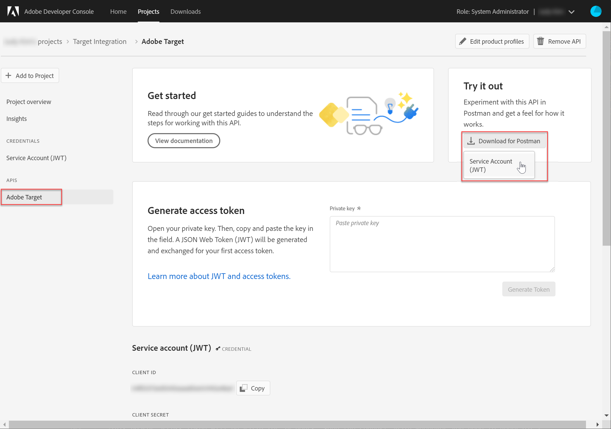
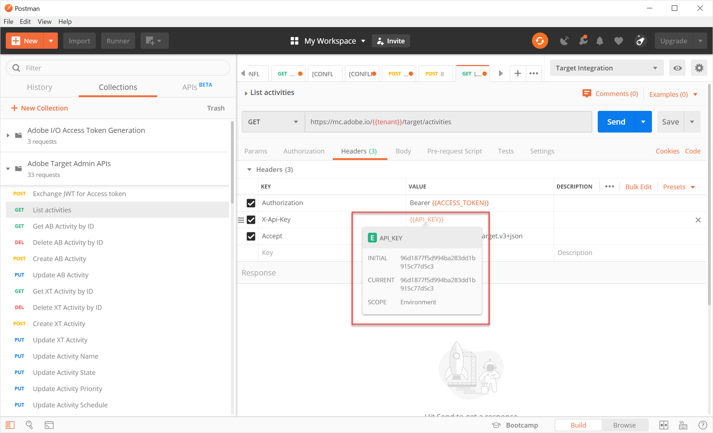

# Configuración de la autenticación para las API de Adobe Target

Las API de administrador de Adobe Target, incluidas las [!DNL Recommendations] API de administrador, están seguras mediante autenticación para garantizar que solo los usuarios autorizados las utilicen para acceder a Adobe Target. Utilice [Adobe Developer Console](https://console.adobe.io/) para administrar esta autenticación en todas las soluciones de Adobe Experience Cloud, incluida [!DNL Target].

Esta lección explica los pasos preliminares necesarios para generar los tokens de autenticación necesarios para interactuar correctamente con las API de Adobe Target. En las secciones que siguen, debe hacer lo siguiente:

1. Cree un proyecto (anteriormente denominado integración) en Adobe Developer Console.
2. Exportar detalles del proyecto a Postman.
3. Genere un token de acceso al portador.
4. Compruebe el token de acceso del portador.

## Requisitos previos

| Recurso | Detalles |
| --- | --- |
| Postman | Para completar estos pasos correctamente, obtenga la [aplicación Postman](https://www.postman.com/downloads/) para su sistema operativo. Postman basic es gratuito con la creación de cuentas. Aunque no es necesario para utilizar las API de Adobe Target en general, Postman facilita los flujos de trabajo de la API y Adobe Target proporciona varias colecciones de Postman para ayudar a ejecutar sus API y aprender a funcionar. El resto de este tutorial asume el conocimiento práctico de Postman. Para obtener ayuda, consulte la [documentación de Postman](https://learning.getpostman.com/). |
| Referencias | Durante el resto de este tutorial se asume la familiaridad con los siguientes recursos:<UL><li>[Adobe I/O Github](https://github.com/adobeio)</li><li>[Documentación del Adobe I/O de Target](https://developers.adobetarget.com/api/#introduction)</li><li>[Documentación de la API de Recommendations](https://developers.adobetarget.com/api/recommendations/)</li></ul> |

## Creación de un proyecto de Adobe I/O

En esta sección, accederá a Adobe Developer Console y creará un proyecto para [!DNL Adobe Target]. Para obtener más información, consulte la [documentación sobre proyectos](https://www.adobe.io/apis/experienceplatform/console/docs.html#!AdobeDocs/adobeio-console/master/projects.md).

<!--1. Generate your private key and public certificate, per the [documentation on authentication](https://www.adobe.io/authentication/auth-methods.html#!AdobeDocs/adobeio-auth/master/JWT/JWTCertificate.md). //<!--as described in **Step 1** of [How to set up Adobe IO: Authentication - Step by Step](https://helpx.adobe.com/marketing-cloud-core/kb/adobe-io-authentication-step-by-step.html). After completing Step 1, return to this tutorial and resume with Step 2, below. // The outcome of this step should be the creation of a `private.key` file and a `certificate_pub.crt` file. Return to this tutorial once you have generated these two files.-->

1. En [Adobe Admin Console](https://adminconsole.adobe.com/), asegúrese de que su cuenta de usuario de Adobe haya obtenido acceso a [nivel ](https://helpx.adobe.com/enterprise/using/admin-roles.html) y [nivel de ](https://helpx.adobe.com/enterprise/using/manage-developers.html) programador a [!DNL Target].

2. En [Adobe Developer Console](https://console.adobe.io/), seleccione la organización del Experience Cloud para la que desea crear esta integración. (Tenga en cuenta que es probable que solo tenga acceso a una única organización de Experience Cloud).

   

3. Haga clic en **[!UICONTROL Crear nuevo proyecto]**.

   

4. Haga clic en **[!UICONTROL Agregar API]** para agregar una API de REST al proyecto para acceder a los servicios y productos de Adobe.

   

5. Seleccione **[!DNL Adobe Target]** como el servicio de Adobe con el que desea integrar. Haga clic en el botón **[!UICONTROL Next]** que aparece.

   

6. Seleccione una opción para asociar claves públicas y privadas con la integración de cuenta de servicio que está creando para Target. Para este tutorial, seleccione **[!UICONTROL Opción 1: Genere un par de claves]** y haga clic en **[!UICONTROL Generate keypair]**.
   

7. ¡Observe los resultados! Como se indica, tome nota del archivo de configuración descargado automáticamente (`config`), que contiene su clave privada. Haga clic en **[!UICONTROL Siguiente]**.
   
8. En el sistema de archivos, compruebe la ubicación de `config`, que es el archivo de configuración comprimido creado en el paso anterior. De nuevo, este `config` archivo contiene su clave privada, que necesitará más adelante. La ubicación exacta dentro del sistema de archivos puede diferir de la que se muestra aquí.
   
9. En la consola de desarrolladores de Adobe, seleccione los [perfiles de producto](https://helpx.adobe.com/enterprise/using/manage-products-and-profiles.html) correspondientes a las propiedades en las que utiliza [!DNL Recommendations]. (Si no utiliza propiedades, seleccione la opción Espacio de trabajo predeterminado ). Haga clic en **[!UICONTROL Guardar API configurada]**.
   

10. Haga clic en **[!UICONTROL Crear integración]**. Debe recibir un mensaje temporal que indique que la API se ha configurado correctamente.

11. Finalmente, cambie el nombre del proyecto por otro más significativo que el `Project 1` original. Para ello, vaya al proyecto utilizando la ruta de navegación como se muestra, haga clic en **[!UICONTROL Editar proyecto]** para acceder al modal **[!UICONTROL Editar proyecto] y cambie el nombre del proyecto.

>[!NOTE]
> 
>En este tutorial, denominamos a nuestro proyecto &quot;Integración de Target&quot;. Si tiene previsto usar el proyecto para algo más que Adobe Target, es posible que desee asignarle un nombre acorde. Por ejemplo, puede elegir llamarlo &quot;API de Adobe&quot; o &quot;API de Experience Cloud&quot;, ya que se puede utilizar con otras soluciones de Adobe Experience Cloud.

## Exportar detalles del proyecto

Ahora que tiene un proyecto de Adobe que puede utilizar para acceder a [!DNL Target], debe asegurarse de enviar los detalles de ese proyecto junto con las solicitudes de API de Adobe. Estos detalles son necesarios para interactuar con varias API de Adobe, incluidas varias API [!DNL Target]. Por ejemplo, los detalles de la integración incluyen la información de autorización y autenticación requerida por las [!DNL Target] API de administración. Por lo tanto, para utilizar las API con Postman, debe introducir esos detalles en Postman.

Existen muchas maneras de especificar los detalles de su proyecto en Postman, pero en esta sección, aprovechamos algunas funciones y colecciones prediseñadas. En primer lugar (en esta sección), exportará los detalles de su integración a un entorno Postman. A continuación (en la sección siguiente), generará un token de acceso de portador para concederle acceso a los recursos de Adobe necesarios.

>[!NOTE]
>
>Para obtener instrucciones de vídeo aplicables a cualquier solución de Experience Cloud, como [!DNL Target], consulte [Uso de Postman con API de Experience Platform](https://experienceleague.adobe.com/docs/platform-learn/tutorials/platform-api-authentication.html?lang=en). Las siguientes secciones son relevantes para las API [!DNL Target] :
>
> 1. Exportar detalles de integración de Adobe I/O a Postman
> 2. Generar un token de acceso con Postman

>
> Estos pasos también se proporcionan a continuación.

1. En la [Consola del desarrollador de Adobe](https://console.adobe.io/), navegue para ver las credenciales de la **[!UICONTROL Cuenta de servicio (JWT)]** de su nuevo proyecto. Utilice la navegación izquierda o la sección **[!UICONTROL Credentials]** como se muestra.
   
En  **[!UICONTROL Detalles de credenciales]**, tenga en cuenta que puede ver la clave  **pública**, el ID del  **cliente** y otra información relacionada con su cuenta de servicio.
   
2. Haga clic en para buscar información sobre la API de **[!UICONTROL Adobe Target]**. Utilice la navegación izquierda o la sección **[!UICONTROL Connected products and services]** como se muestra.
   
3. Haga clic en **[!UICONTROL Descargar para Postman]** > **[!UICONTROL Cuenta de servicio (JWT)]** para crear un archivo JSON que capture su información de autenticación para un entorno Postman.
   
Tenga en cuenta el archivo JSON en su sistema de archivos.
   
4. En Postman, haga clic en el icono de engranaje para administrar sus entornos y, a continuación, haga clic en **Import** para importar el archivo JSON (entorno).
   
5. Elija el archivo y haga clic en **Open**.
   
6. En el modal **Manage Environments** de Postman, haga clic en el nombre del entorno recién importado para inspeccionarlo. (El nombre del entorno puede ser diferente del que se muestra aquí. Edite el nombre como desee. No es necesario que coincida necesariamente con el nombre del proyecto de Adobe).
   
7. Las notas `CLIENT_SECRET` y `API_KEY` (junto con otras variables) tienen sus valores rellenados previamente, tomados de la integración definida en Adobe Developer Console. (La variable Postman `CLIENT_SECRET` debe coincidir con la credencial de Adobe `CLIENT SECRET` tal como se muestra en Developer Console, y `API_KEY` en Postman también debe coincidir con `CLIENT ID` en Developer Console). Por el contrario, las notas `PRIVATE_KEY`, `JWT_TOKEN` y `ACCESS_TOKEN` están en blanco. Comencemos por proporcionar el valor `PRIVATE_KEY`.
   

   >[!NOTE]
   >
   >**¡Sorpresa!**
   >
   >¡Preguntas más frecuentes! ¿Recuerdas dónde está tu llave privada?
   >Correcto, está en el archivo `config` descargado anteriormente desde la consola de desarrolladores de Adobe.

8. En el sistema de archivos, abra el archivo `config` y abra el archivo de clave `private`.
   
9. Seleccione y copie todo el contenido del archivo de claves `private`.
   
10. En Postman, pegue el valor de la clave privada en los campos **INITIAL VALUE** y **CURRENT VALUE**.
   
11. Haga clic en **[!UICONTROL Update]** y cierre el modal Entornos.

## Generar el token de acceso del portador

En esta sección, se genera el token de acceso de portador, que es necesario para autenticar la interacción con las API de Adobe Target. Para generar el token de acceso al portador, debe enviar los detalles de integración (establecidos en las secciones anteriores) al [Servicio de Identity Management de Adobe (IMS)](https://www.adobe.io/authentication/auth-methods.html#!AdobeDocs/adobeio-auth/master/AuthenticationOverview/AuthenticationGuide.md). Existen varias formas de hacerlo, pero en este tutorial tenemos que crear una solicitud de POST personalizada para la API de IMS. Estoy bromeando. En este tutorial, aprovechamos una colección Postman que contiene una llamada IMS prediseñada que hace que el proceso sea directo y fácil. Una vez importada la colección, puede volver a utilizarla cuando sea necesario para generar nuevos tokens no solo para Adobe Target, sino también para otras API de Adobe.

1. Vaya a [Adobe Identity Management Service API sample calls](https://github.com/adobe/experience-platform-postman-samples/tree/master/apis/ims).
   
2. Haga clic en la **colección Postman de generación de tokens de acceso a Adobe I/O**.
   
3. Obtenga el JSON sin procesar para esta colección haciendo clic en **Sin procesar** y copiando el JSON resultante en el portapapeles. (Como alternativa, puede guardar el JSON sin procesar como archivo .json).
   
4. En Postman, importe la colección pegando y enviando el JSON sin procesar desde el portapapeles. (Como alternativa, puede cargar el archivo .json que guardó). Haga clic en **Continuar**.
   
5. Seleccione el **[!UICONTROL IMS: Genere + autenticación JWT mediante la solicitud Token]** del usuario en la colección Postman de generación de tokens de acceso al Adobe I/O, compruebe que su entorno esté seleccionado y haga clic en **Enviar** para generar el token.

   

   >[!NOTE]
   >
   >Este token de acceso al portador será válido durante 24 horas. Vuelva a enviar la solicitud siempre que necesite generar un token nuevo.

6. Vuelva a abrir el modal Administrar entornos y seleccione el entorno.
   
7. Tenga en cuenta que los valores `ACCESS_TOKEN` y `JWT_TOKEN` ahora se rellenan.
   

>[!NOTE]
>
>P: ¿Tengo que usar la colección Postman de generación de tokens de acceso a Adobe I/O para generar el token web JSON (JWT) y el token de acceso al portador?
>
>A: ¡No! La colección Postman de generación de tokens de acceso al Adobe I/O está disponible como una conveniencia para generar más fácilmente el JWT y el token de acceso al portador en Postman. Como alternativa, puede utilizar las funcionalidades de Adobe Developer Console para generar manualmente el token de acceso al portador.

## Comprobación del token de acceso del portador

En este ejercicio, utilizará el nuevo token de acceso de portador enviando una solicitud de API que recupera una lista de actividades de su cuenta [!DNL Target]. Una respuesta correcta indica que el proyecto de Adobe y la autenticación funcionan según lo esperado para utilizar la API.

1. Importe la [Colección Postman de las API de administración de Adobe Target](https://developers.adobetarget.com/api/#admin-postman-collection). Siga todas las indicaciones hasta que la colección se importe en Postman.
   
1. Expanda la colección y anote la solicitud **[!UICONTROL List activities]**.
   
1. Tenga en cuenta que variables como `{{access_token}}` no se han resuelto inicialmente. Esto se puede resolver de varias maneras diferentes (por ejemplo, podría definir una nueva variable de colección llamada `{{access_token}}`), pero en este tutorial, cambiará la solicitud de API para aprovechar el entorno Postman que estaba utilizando anteriormente. Esto permitirá que el entorno siga funcionando como una consolidación única y coherente de todas las variables comunes entre las API de Adobe.
   
1. Escriba para reemplazar `{{access_token}}` por `{{ACCESS_TOKEN}}`.
   
1. Escriba para reemplazar `{{api_key}}` por `{{API_KEY}}`.
   
1. Escriba para reemplazar `{{tenant}}` por `{{TENANT_ID}}`. La nota `{{TENANT_ID}}` aún no se reconoce.
   
1. Abra el modal Manage Environments y seleccione su entorno.
   
1. Escriba para agregar una nueva variable de entorno `{{TENANT_ID}}`. Copie y pegue su valor de ID de inquilino en los campos **INITIAL VALUE** y **CURRENT VALUE** para la nueva variable de entorno `TENANT_ID`.

   

   >[!NOTE]
   >
   >El ID del inquilino es diferente de su [!DNL Target] `clientcode`. El ID del inquilino existe en la dirección URL cuando ha iniciado sesión en [!DNL Target]. Para obtener su ID de inquilino, inicie sesión en [!DNL Adobe Experience Cloud], abra [!DNL Target] y haga clic en la tarjeta [!DNL Target] . Utilice el valor de ID de inquilino como se indica en el subdominio de URL.
   >
   >Por ejemplo, si la dirección URL cuando se inicia sesión en Adobe Target es
   >
   >`<https://mycompany.experiencecloud.adobe.com/...>`
   >
   >su ID de inquilino es &quot;mycompany&quot;.

1. Envíe la solicitud después de asegurarse de que ha seleccionado el entorno correcto. Debe recibir una respuesta que contenga su lista de actividades.
   

¡Felicidades! Ahora que ha comprobado la autenticación de su Adobe, puede utilizarla para interactuar con las API de Adobe Target (así como con otras API de Adobe). Por ejemplo, puede [usar las API de Recommendations](https://experienceleague.adobe.com/docs/target-learn/recommendations-api-tutorial/recs-api-overview.html?lang=en) para crear o administrar recomendaciones.
