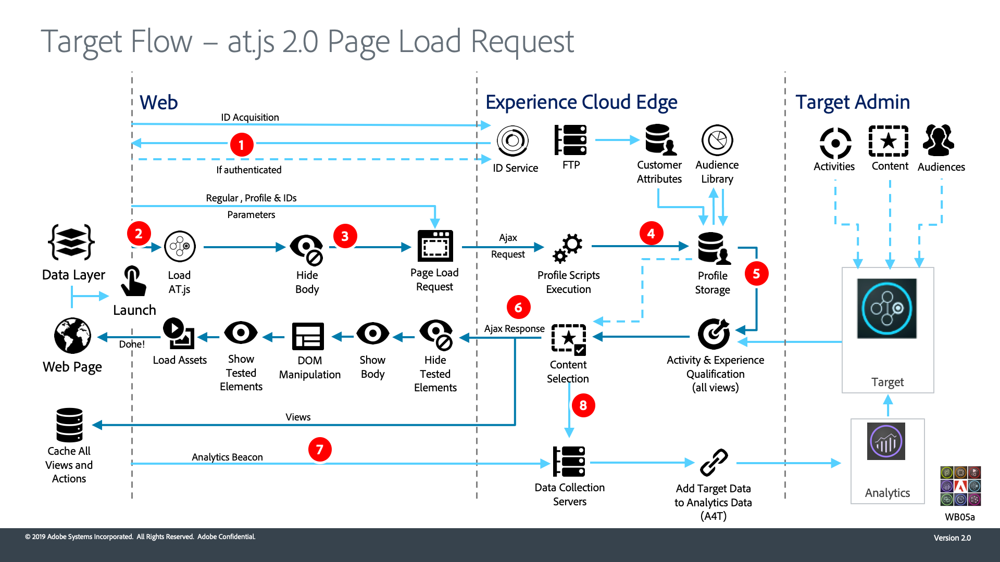

# Cómo funciona Adobe Target at.js 2.0

`at.js` 2.0 mejora la compatibilidad de Adobe Target con aplicaciones de una sola página (SPA) e integra otras soluciones de Experience Cloud. Este vídeo y los diagramas que lo acompañan explican cómo todo se une.

>[!VIDEO](https://video.tv.adobe.com/v/26250?quality=12)

## Diagramas de arquitectura

1. La llamada devuelve un ID de Experience Cloud (ECID). Si el usuario está autenticado, otra llamada sincroniza el ID del cliente.

1. `at.js` la biblioteca de carga sincrónicamente y oculta el cuerpo del documento (también `at.js` puede cargarse asincrónicamente con un fragmento de ocultamiento previo opcional implementado en la página).

1. La solicitud de carga de página se realiza incluyendo todos los parámetros configurados, ECID, SDID e ID de cliente.

1. Los scripts de perfil se ejecutan y se incluyen en el [!UICONTROL Almacenamiento de perfiles]. El Almacenamiento solicita audiencias de la [!UICONTROL Biblioteca de audiencias] que cumplan los requisitos (por ejemplo, audiencias compartidas de [!DNL Analytics], Audience Manager, etc.). [!UICONTROL Los ] atributos del cliente se envían al  [!UICONTROL Almacenamiento de ] perfiles en un proceso por lotes.
1. En función de la dirección URL, los parámetros de solicitud y los datos de perfil, [!DNL Target] decide qué actividades y experiencias vuelven al visitante para la página actual y las vistas futuras

1. Contenido dirigido devuelto a la página, incluyendo de forma opcional los valores de perfil para una personalización adicional.

   El contenido dirigido se muestra en la página actual lo más rápido posible y sin parpadeo del contenido predeterminado.

   El contenido dirigido para vistas futuras de una aplicación de una sola página se almacena en caché en el explorador, por lo que se puede aplicar instantáneamente sin una llamada al servidor adicional cuando se activan las vistas. (Consulte el siguiente diagrama para ver el comportamiento `triggerView()`).

1. [!DNL Analytics] datos enviados desde la página a  [!UICONTROL Data ] CollectionServers
1. [!DNL Target]Se comparan los datos de con los datos de mediante el SDID y se procesan en el almacén de informes de Analytics. [!DNL Analytics] [!DNL Analytics] Por lo tanto, los datos de se pueden visualizar tanto en como  [!DNL Analytics] a  [!DNL Target] través de los informes de A4T.

1. `adobe.target.triggerView()` se llama en la aplicación de una sola página
1. El contenido dirigido para la vista se lee desde la caché

1. El contenido dirigido se muestra lo más rápido posible y sin parpadeo del contenido predeterminado

1. La solicitud de notificación se envía al Almacenamiento de perfiles de [!DNL Target] para contar al visitante en la actividad e incrementar las métricas
1. [!DNL Analytics] los datos se envían de la SPA a  [!UICONTROL Data ] CollectionServers

1. [!DNL Target] los datos se envían del  [!DNL Target] servidor a  [!UICONTROL Data ] CollectionServers. Se comparan los datos de [!DNL Target] con los datos de [!DNL Analytics] mediante el SDID y se procesan en el almacén de informes de [!DNL Analytics]. [!DNL Analytics] Por lo tanto, los datos de se pueden visualizar tanto en como  [!DNL Analytics] a  [!DNL Target] través de los informes de A4T.

## Recursos adicionales

* [Implementar at.js 2.0 en una aplicación de una sola página](implement-atjs-20-in-a-single-page-application.md)
* [Uso del Compositor de experiencias visuales de Adobe Target para aplicaciones de una sola página (SPA VEC)](../experiences/use-the-visual-experience-composer-for-single-page-applications.md)
* [Cómo funciona at.js la documentación](https://docs.adobe.com/content/help/en/target/using/implement-target/client-side/at-js/how-atjs-works.html)