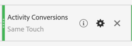

# Configuración de informes de A4T en [!DNL Analysis Workspace] para [!DNL Auto-Target] actividades

>[!NOTE]
>
>Esta funcionalidad está actualmente en versión beta y estará disponible para todos los usuarios [Target Premium](https://experienceleague.adobe.com/docs/target/using/introduction/intro.html?lang=en#premium){target=_blank} clientes en una próxima versión.

>[!IMPORTANT]
>
>Para [!UICONTROL Segmentación automática] actividades, debe registrar el informe en [!DNL Analytics Workspace] y cree manualmente un panel de A4T.

El [!UICONTROL Analytics for Target] Integración de (A4T) para [!DNL Auto-Target] Las actividades de utilizan el [!DNL Adobe Target] combine algoritmos de aprendizaje automático (ML) para elegir la mejor experiencia para cada visitante en función de su perfil, comportamiento y contexto, todo mientras utiliza un [!DNL Adobe Analytics] métrica de objetivo.

Aunque las funcionalidades de análisis enriquecidas están disponibles en [!DNL Adobe Analytics] [!DNL Analysis Workspace], algunas modificaciones en el valor predeterminado **[!UICONTROL Analytics for Target]** Los paneles deben interpretar correctamente [!DNL Auto-Target] actividades, debido a diferencias entre actividades de experimentación (manual) [!UICONTROL Prueba A/B] y [!UICONTROL Asignación automática]) y actividades de personalización ([!UICONTROL [!UICONTROL Segmentación automática]]).

Este tutorial muestra las modificaciones recomendadas para el análisis [!UICONTROL Segmentación automática] actividades en [!DNL Analysis Workspace], que se basan en los siguientes conceptos clave:

* El **[!UICONTROL Control frente a objetivo]** La dimensión se puede utilizar para distinguir entre [!UICONTROL Control] experiencias frente a las proporcionadas por [!UICONTROL Segmentación automática] Ensamblar algoritmo XML.
* Las visitas deben utilizarse como métrica de normalización al ver desgloses de rendimiento de nivel de experiencia. Además, [La metodología de contabilización predeterminada de Adobe Analytics puede incluir visitas en las que el usuario no ve realmente contenido de actividad](https://experienceleague.adobe.com/docs/target/using/integrate/a4t/a4t-faq/a4t-faq-viewing-reports.html?lang=en#metrics), pero este comportamiento predeterminado se puede modificar mediante un segmento con el ámbito adecuado (detalles más abajo).
* La atribución con ámbito de retrospectiva de visita, también conocida como &quot;ventana retrospectiva de visita&quot; en el modelo de atribución prescrito, la utiliza la variable [!DNL Adobe Target] Los modelos XML durante sus fases de formación y el mismo modelo de atribución (no predeterminado) deben utilizarse al desglosar la métrica de objetivo.

## Creación de A4T para [!UICONTROL Segmentación automática] panel en [!DNL Analysis Workspace]

Para crear un A4T para [!UICONTROL Segmentación automática] informe, comience con el **[!UICONTROL Analytics for Target]** panel en [!DNL Analysis Workspace], como se muestra a continuación, o comience con una tabla de forma libre. A continuación, realice las siguientes selecciones:

1. **[!UICONTROL Experiencia de control]**: puede elegir cualquier experiencia, pero anulará esta opción más adelante. Observe que para [!UICONTROL Segmentación automática] , la experiencia de control es en realidad una estrategia de control, que consiste en a) servir aleatoriamente entre todas las experiencias o b) servir una sola experiencia (esta opción se realiza en el momento de la creación de la actividad en [!DNL Adobe Target]). Incluso si optó por la opción (b), su [!UICONTROL Segmentación automática] actividad designó una experiencia específica como control. Debe seguir el método descrito en este tutorial para analizar A4T para [!UICONTROL Segmentación automática] actividades.
2. **[!UICONTROL Métrica de normalización]**: Seleccionar [!UICONTROL Visitas].
3. **[!UICONTROL Métricas de éxito]**: Aunque puede seleccionar cualquier métrica de la que informar, generalmente debe ver los informes de la misma métrica que se eligió para la optimización durante la creación de la actividad en [!DNL Target].

   ![[!UICONTROL Analytics for Target] configuración del panel para [!UICONTROL Segmentación automática] actividades.](assets/Figure1.png)

   *Figura 1: [!UICONTROL Analytics for Target] configuración del panel para [!UICONTROL Segmentación automática] actividades.*

>[!TIP]
>
>Para configurar su [!UICONTROL Analytics for Target] panel para [!UICONTROL Segmentación automática] actividades, elija cualquier experiencia de control, elija [!UICONTROL Visitas] como métrica de normalización y elija la misma métrica de objetivo elegida para la optimización durante [!DNL Target] creación de actividades.

## Utilice el [!UICONTROL Control frente a objetivo] dimensión para comparar el [!DNL Target] Ensamblar el modelo XML al control

El panel predeterminado de A4T está diseñado para clásico (manual) [!UICONTROL Prueba A/B] o [!UICONTROL Asignación automática] actividades en las que el objetivo es comparar el rendimiento de las experiencias individuales con el de la experiencia de control. Entrada [!UICONTROL Segmentación automática] sin embargo, la comparación de primer orden debe ser entre el control *estrategia* y el objetivo *estrategia*. En otras palabras, determinar el alza del rendimiento global de la [!UICONTROL Segmentación automática] ensamblar el modelo XML sobre la estrategia de control).

Para realizar esta comparación, utilice el **[!UICONTROL Control frente a objetivo (Analytics for Target)]** dimensión. Arrastre y suelte para reemplazar el **[!UICONTROL Experiencias de Target]** en el informe predeterminado de A4T.

Tenga en cuenta que este reemplazo invalida el valor predeterminado [!UICONTROL Alza y confianza] cálculos en el panel A4T. Para evitar confusiones, puede eliminar estas métricas del panel predeterminado y dejar el siguiente informe:

![[!UICONTROL Experiencias por conversiones de actividad] panel en [!DNL Analysis Workspace]](assets/Figure2.png)

*Figura 2: El informe de referencia recomendado para [!DNL Auto-Target] actividades. Este informe se ha configurado para comparar el tráfico de destino (servido por el modelo XML ensamblado) con el tráfico de control.*

>[!NOTE]
>
>Actualmente, [!UICONTROL Alza y confianza] Los números de no están disponibles para [!UICONTROL Control frente a objetivo] dimensiones para informes de A4T para [!UICONTROL Segmentación automática]. Hasta que se añada compatibilidad, [!UICONTROL Alza y confianza] se puede calcular manualmente descargando el [calculadora confianza](https://experienceleague.adobe.com/docs/target/assets/complete_confidence_calculator.xlsx?lang=en).

## Agregar desgloses de métricas de nivel de experiencia

Para obtener más información sobre el rendimiento del modelo XML ensamblado, puede examinar los desgloses de nivel de experiencia del **[!UICONTROL Control frente a objetivo]** dimensión. Entrada [!DNL Analysis Workspace], arrastre el **[!UICONTROL Experiencias de Target]** en el informe y, a continuación, desglose cada una de las dimensiones de control y de destino por separado.

![[!UICONTROL Experiencias por conversiones de actividad] panel en [!DNL Analysis Workspace]](assets/Figure3.png)

*Figura 3: Desglose de la dimensión de segmentación por experiencias de Target*

Aquí se muestra un ejemplo del informe resultante.

![[!UICONTROL Experiencias por conversiones de actividad] panel en [!DNL Analysis Workspace]](assets/Figure4.png)

*Figura 4: Un estándar [!UICONTROL Segmentación automática] con desgloses de nivel de experiencia. Tenga en cuenta que la métrica de objetivo puede ser diferente y la estrategia de control puede tener una sola experiencia.*

>[!TIP]
>
>Entrada [!DNL Analysis Workspace], haga clic en el icono de engranaje para ocultar los porcentajes en la [!UICONTROL Tasa de conversión] para mantener el enfoque en las tasas de conversión de la experiencia. Las tasas de conversión se formatean como decimales, pero se interpretan como porcentajes en consecuencia.

## Por qué &quot;[!UICONTROL Visitas]&quot; es la métrica de normalización correcta para [!UICONTROL Segmentación automática] actividades

Al analizar un [!UICONTROL Segmentación automática] actividad, elegir siempre [!UICONTROL Visitas] como métrica de normalización predeterminada. [!UICONTROL Segmentación automática] la personalización selecciona una experiencia para un visitante una vez por visita (formalmente, una vez por visita) [!DNL Target] sesión), lo que significa que la experiencia mostrada a un visitante puede cambiar en cada visita. Por lo tanto, si usa [!UICONTROL Visitantes únicos] como métrica de normalización, el hecho de que un solo usuario pueda terminar viendo varias experiencias (en diferentes visitas) llevaría a tasas de conversión confusas.

Un ejemplo sencillo demuestra este punto: imagine un escenario en el que dos visitantes entran en una campaña que solo tiene dos experiencias. El primer visitante lo visita dos veces. Se les asigna la Experiencia A en la primera visita, pero la Experiencia B en la segunda visita (debido a que su estado de perfil cambió en esa segunda visita). Después de la segunda visita, el visitante convierte realizando un pedido. La conversión se atribuye a la experiencia mostrada más recientemente (Experiencia B). El segundo visitante también visita dos veces y se muestra en la Experiencia B ambas veces, pero nunca se convierte.

Vamos a comparar los informes de nivel de visitante y de nivel de visita:

| Experiencia | Visitantes únicos | Visitas | Conversiones | Tasa de conversión normalizada por visitantes | Tasa de conversión normalizada por visitas |
| --- | --- | --- | --- | --- | --- |
| Una | 1 | 1 | - | 0% | 0% |
| B | 2 | 3 | 1 | 50% | 33.3% |
| Totales | 2 | 4 | 1 | 50% | 25 % |

*Tabla 1: Ejemplo de comparación de informes normalizados por el visitante y por la visita para un escenario en el que las decisiones se mantienen fijas en una visita (y no en el visitante, como sucede con las pruebas A/B regulares). Las métricas normalizadas por visitantes son confusas en este escenario.*

Como se muestra en la tabla, existe una clara incongruencia entre las cifras a nivel de visitante. A pesar de que hay dos visitantes únicos totales, no se trata de una suma de visitantes únicos individuales para cada experiencia. Aunque la tasa de conversión a nivel de visitante no es necesariamente incorrecta, cuando se comparan experiencias individuales, las tasas de conversión a nivel de visita probablemente tengan mucho más sentido. Formalmente, la unidad de análisis (&quot;visitas&quot;) es la misma que la unidad de permanencia en la toma de decisiones, lo que significa que se pueden agregar y comparar desgloses de métricas a nivel de experiencia.

## Filtro de las visitas reales a la actividad

El [!DNL Adobe Analytics] metodología de contabilización predeterminada para visitas a un [!DNL Target] La actividad puede incluir visitas en las que el usuario no interactuó con el [!DNL Target] actividad. Esto se debe a la forma [!DNL Target] las asignaciones de actividad persisten en [!DNL Analytics] contexto del visitante. Como resultado, el número de visitas a la [!DNL Target] la actividad de puede estar inflada, lo que da como resultado una disminución de las tasas de conversión.

Si prefiere informar sobre las visitas en las que el usuario realmente interactuó con el [!UICONTROL Segmentación automática] actividad (ya sea mediante la entrada a la actividad, un evento de visualización o visita o una conversión), puede:

1. Cree un segmento específico que incluya visitas desde el [!DNL Target] actividad en cuestión y, a continuación,
1. Filtrar el [!UICONTROL Visitas] métrica que utiliza este segmento.

**Para crear el segmento:**

1. Seleccione el **[!UICONTROL Componentes > Crear segmento]** en la opción [!DNL Analysis Workspace] barra de herramientas.
2. Especifique un **[!UICONTROL Título]** para su segmento. En el ejemplo que se muestra a continuación, el segmento se denomina [!DNL "Hit with specific Auto-Target activity"].
3. Arrastre el **[!UICONTROL Actividades de Target]** dimensión al segmento **[!UICONTROL Definición]** sección.
4. Utilice el **[!UICONTROL igual a]** operador.
5. Busque su específico [!DNL Target] actividad.
6. Haga clic en el icono de engranaje y seleccione **[!UICONTROL Modelo de atribución > Instancia]** como se muestra en la figura siguiente.
7. Haga clic en **[!UICONTROL Guardar]**.

![Segmento en [!DNL Analysis Workspace]](assets/Figure5.png)

*Figura 5: Utilice un segmento como el que se muestra aquí para filtrar la [!UICONTROL Visitas] en su A4T para [!UICONTROL Segmentación automática] informe*

Una vez creado el segmento, utilícelo para filtrar los [!UICONTROL Visitas] métrica, por lo que [!UICONTROL Visitas] La métrica solo incluye las visitas en las que el usuario interactuó con el [!DNL Target] actividad.

**Para filtrar [!UICONTROL Visitas] uso de este segmento:**

1. Arrastre el segmento recién creado desde la barra de herramientas de componentes y pase el ratón por encima de la base del **[!UICONTROL Visitas]** etiqueta de métrica hasta un azul **[!UICONTROL Filtrar por]** aparece el mensaje.
2. Suelte el segmento. El filtro se aplica a esa métrica.

El panel final aparece de la siguiente manera:

![[!UICONTROL Experiencias por conversiones de actividad] panel en [!DNL Analysis Workspace]](assets/Figure6.png)

*Figura 6: Panel de informes con el segmento &quot;Visita con actividad de segmentación automática específica&quot; aplicado a [!UICONTROL Visitas] métrica. Este segmento garantiza que solo las visitas en las que un usuario realmente interactuó con el [!DNL Target] actividad en cuestión se incluyen en el informe.*

## Alinee la atribución entre la formación del modelo XML y la generación de métricas de objetivo

La integración de A4T permite que [!UICONTROL Segmentación automática] Modelo XML que se va a modificar *entrenado* utilizando los mismos datos de evento de conversión que [!DNL Adobe Analytics] utiliza para *generar informes de rendimiento*. Sin embargo, hay ciertas suposiciones que deben emplearse para interpretar estos datos al entrenar los modelos XML, que difieren de las suposiciones predeterminadas realizadas durante la fase de creación de informes en [!DNL Adobe Analytics].

En concreto, la variable [!DNL Adobe Target] Los modelos XML utilizan un modelo de atribución de ámbito de visita. Es decir, los modelos ML suponen que una conversión debe producirse en la misma visita que una visualización de contenido para la actividad para que la conversión se &quot;atribuya&quot; a la decisión tomada por el modelo ML. Esto es necesario para [!DNL Target] garantizar la formación oportuna de sus modelos; [!DNL Target] no puede esperar hasta 30 días una conversión (la ventana de atribución predeterminada para los informes de ) [!DNL Adobe Analytics]) antes de incluirla en los datos de formación de sus modelos.

Por lo tanto, la diferencia entre la atribución utilizada por [!DNL Target] modelos (durante la formación) frente a la atribución predeterminada utilizada para consultar datos (durante la generación del informe) pueden provocar discrepancias. Incluso podría parecer que los modelos ML tienen un mal rendimiento, cuando en realidad el problema reside en la atribución.

>[!TIP]
>
>Si los modelos XML se están optimizando para una métrica que se atribuye de forma diferente a la de las métricas que está viendo en un informe, es posible que los modelos no funcionen según lo esperado. Para evitar esta situación, asegúrese de que las métricas de objetivo del informe utilicen la misma atribución utilizada por el [!DNL Target] Modelos ML.

Para ver métricas de objetivo que tienen la misma metodología de atribución utilizada por [!DNL Target] Modelos ML, siga estos pasos:

1. Pase el ratón sobre el icono de engranaje de la métrica de objetivo:

   

1. En el menú resultante, desplácese hasta **[!UICONTROL Configuración de datos]**.
1. Seleccionar **[!UICONTROL Uso de modelos de atribución no predeterminados]** (si no está seleccionada).

   

1. Haga clic en **[!UICONTROL Editar]**.
1. Seleccionar **[!UICONTROL Modelo]**: **[!UICONTROL Participación]**, y **[!UICONTROL Ventana retroactiva]**: **[!UICONTROL Visita]**.

   

1. Haga clic en **[!UICONTROL Aplicar]**. 

Estos pasos garantizan que el informe atribuya la métrica de objetivo a la visualización de la experiencia, si se produjo el evento de la métrica de objetivo *en cualquier momento* (&quot;participación&quot;) en la misma visita en la que se mostró una experiencia.

## Paso final: Cree una tasa de conversión que capture la magia anterior

Con las modificaciones de la [!UICONTROL Visita] y las métricas de objetivo de las secciones anteriores son la modificación final que debe realizar en su A4T predeterminado para [!UICONTROL Segmentación automática] el panel de creación de informes consiste en crear tasas de conversión que sean la proporción correcta (la de una métrica de objetivo con la atribución correcta) con respecto a una métrica filtrada correctamente [!UICONTROL Visitas] métrica.

Para ello, cree un [!UICONTROL Métrica calculada] siga estos pasos:

1. Seleccione el **[!UICONTROL Componentes > Crear métrica]** en la opción [!DNL Analysis Workspace] barra de herramientas.
1. Especifique un **[!UICONTROL Título]** para su métrica. Por ejemplo, &quot;Tasa de conversión corregida por la visita para la actividad XXX&quot;.
1. Seleccionar **[!UICONTROL Formato]** = Porcentaje y **[!UICONTROL Lugares decimales]** = 2.
1. Arrastre la métrica de objetivo correspondiente a su actividad (por ejemplo, [!UICONTROL Conversiones de actividades]) en la definición y utilice el icono de engranaje en esta métrica de objetivo para ajustar el modelo de atribución a (participación|visita), como se describió anteriormente.
1. Seleccionar **[!UICONTROL Agregar > Contenedor]** desde la parte superior derecha de la **[!UICONTROL Definición]** sección.
1. Seleccione el operador de división (÷) entre los dos contenedores.
1. Arrastre el segmento creado anteriormente, denominado &quot;Visita con&quot; específico [!UICONTROL Segmentación automática] actividad&quot; en este tutorial para esta actividad específica [!DNL Auto-Target] actividad.
1. Arrastre el **[!UICONTROL Visitas]** en el contenedor de segmentos.
1. Haga clic en **[!UICONTROL Guardar]**.

La definición completa de la métrica calculada se muestra aquí.

*Figura 7: Definición de la métrica de tasa de conversión del modelo corregido por la visita y corregido por la atribución. Tenga en cuenta que esta métrica depende de la métrica de objetivos y de la actividad. En otras palabras, esta definición de métrica no se puede reutilizar en todas las actividades).*

>[!IMPORTANT]
>
>El [!UICONTROL Conversión] La métrica de tasa del panel A4T no está vinculada al evento de conversión o a la métrica de normalización de la tabla. Cuando realice las modificaciones sugeridas en este tutorial, la variable [!UICONTROL Conversión] La tasa no se adapta automáticamente a los cambios. Por lo tanto, si realiza la modificación en la atribución del evento de conversión o en la métrica de normalización (o en ambas), debe recordar como paso final para modificar también la variable [!UICONTROL Conversión] , como se muestra arriba.

## Resumen: Muestra final [!DNL Analysis Workspace] panel para [!UICONTROL Segmentación automática] informes

Al combinar todos los pasos anteriores en un solo panel, la figura siguiente muestra una vista completa del informe recomendado para [!UICONTROL Segmentación automática] Actividades de A4T. Este informe es el mismo que el que utiliza el [!DNL Target] Modelos XML para optimizar la métrica de objetivo. El informe incorpora todos los matices y recomendaciones que se examinan en este tutorial. Este informe también es el más cercano a las metodologías de contabilización utilizadas en la versión tradicional [!DNL Target]Impulsado por informes [!UICONTROL Segmentación automática] actividades.

![Informe final de A4T en [!DNL Analysis Workspace]](assets/Figure8.png "Informe A4T en Analysis Workspace"){width="600" zoomable="yes"}

*Figura 8: A4T final [!UICONTROL Segmentación automática] informar en [!DNL Adobe Analytics] [!DNL Workspace], que combina todos los ajustes realizados en las definiciones de métricas descritas en las secciones anteriores de este tutorial.*
