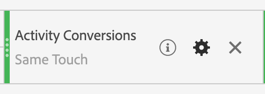
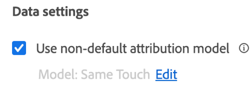
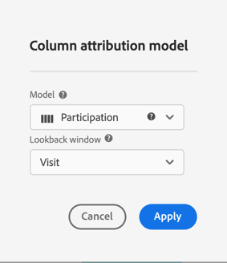
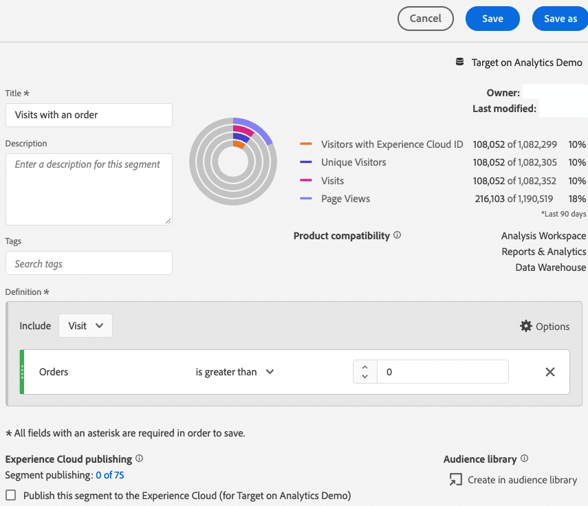
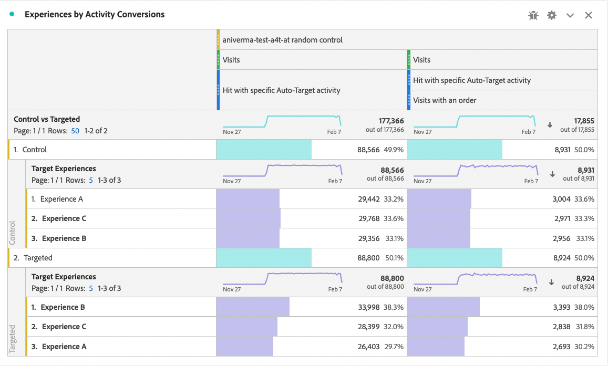
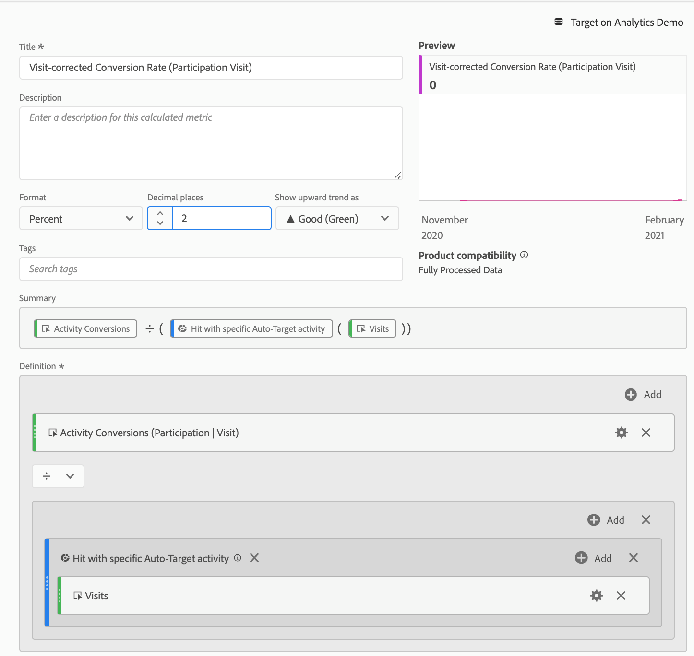

# Configurar informes de A4T en [!DNL Analysis Workspace] para [!DNL Auto-Target] actividades

>[!IMPORTANT]
>
>Para las actividades de [!UICONTROL Segmentación automática], debe comprobar los informes en [!DNL Analytics Workspace] y crear manualmente un panel de A4T.

La integración de [!UICONTROL Analytics for Target] (A4T) para actividades [!DNL Auto-Target] usa los algoritmos de aprendizaje automático (ML) de ensamblado [!DNL Adobe Target] para elegir la mejor experiencia para cada visitante en función de su perfil, comportamiento y contexto, todo mientras usa una métrica de objetivos de [!DNL Adobe Analytics].

Aunque hay funcionalidades de análisis enriquecidas disponibles en [!DNL Adobe Analytics] [!DNL Analysis Workspace], se requieren algunas modificaciones en el panel predeterminado de **[!UICONTROL Analytics for Target]** para interpretar correctamente las actividades de [!DNL Auto-Target], debido a diferencias entre las actividades de experimentación (prueba manual [!UICONTROL A/B] y [!UICONTROL Asignación automática]) y las actividades de personalización ([!UICONTROL [!UICONTROL Segmentación automática]]).

Este tutorial muestra las modificaciones recomendadas para analizar las actividades de [!UICONTROL Segmentación automática] en [!DNL Analysis Workspace], que se basan en los siguientes conceptos clave:

* La dimensión **[!UICONTROL Control vs. Objetivo]** se puede usar para distinguir entre las experiencias [!UICONTROL Control] y las que ofrece el algoritmo ML de ensamblado [!UICONTROL Segmentación automática].
* Las visitas deben utilizarse como métrica de normalización al ver desgloses de rendimiento de nivel de experiencia. Además, la metodología de contabilización predeterminada de [Adobe Analytics podría incluir visitas en las que el usuario no ve realmente contenido de actividad](https://experienceleague.adobe.com/docs/target/using/integrate/a4t/a4t-faq/a4t-faq-viewing-reports.html?lang=es#metrics){target=_blank}, pero este comportamiento predeterminado se puede modificar mediante un segmento con el ámbito adecuado (detalles a continuación).
* La atribución con ámbito de retrospectiva de visita, también conocida como &quot;ventana retrospectiva de visita&quot; en el modelo de atribución prescrito, la utilizan los modelos XML de [!DNL Adobe Target] durante sus fases de formación, y se debe utilizar el mismo modelo de atribución (no predeterminado) al desglosar la métrica de objetivo.

## Crear A4T para el panel [!UICONTROL Segmentación automática] en [!DNL Analysis Workspace]

Para crear un informe de A4T para [!UICONTROL Segmentación automática], comience con el panel **[!UICONTROL Analytics for Target]** en [!DNL Analysis Workspace], como se muestra a continuación, o comience con una tabla de forma libre. A continuación, realice las siguientes selecciones:

1. **[!UICONTROL Experiencia de control]**: Puede elegir cualquier experiencia; sin embargo, anulará esta opción más adelante. Tenga en cuenta que para las actividades de [!UICONTROL Segmentación automática], la experiencia de control es realmente una estrategia de control, que consiste en a) servir aleatoriamente entre todas las experiencias o b) servir una sola experiencia (esta opción se realiza en el momento de la creación de la actividad en [!DNL Adobe Target]). Incluso si optó por la opción (b), su actividad [!UICONTROL Segmentación automática] designó una experiencia específica como control. Debe seguir el enfoque descrito en este tutorial para analizar A4T para las actividades de [!UICONTROL Segmentación automática].
2. **[!UICONTROL Métrica De Normalización]**: Seleccione [!UICONTROL Visitas].
3. **[!UICONTROL Métricas de éxito]**: Aunque puede seleccionar las métricas de las que desee informar, generalmente debería ver los informes de la misma métrica que se eligió para la optimización durante la creación de la actividad en [!DNL Target].

   Configuración del panel ![[!UICONTROL Analytics for Target] para [!UICONTROL actividades de segmentación automática].](assets/Figure1.png)

   *Figura 1: configuración del panel de [!UICONTROL Analytics for Target] para las actividades de [!UICONTROL Segmentación automática].*

>[!TIP]
>
>Para configurar el panel [!UICONTROL Analytics for Target] para las actividades de [!UICONTROL Segmentación automática], elija cualquier experiencia de control, elija [!UICONTROL Visitas] como métrica de normalización y elija la misma métrica de objetivo que se eligió para la optimización durante la creación de la actividad de [!DNL Target].

## Usar el control [!UICONTROL frente aDimensión &#x200B;] de destino para comparar el modelo XML de ensamblado [!DNL Target] con el control

El panel predeterminado de A4T está diseñado para las actividades clásicas (manuales) de [!UICONTROL prueba A/B] o [!UICONTROL asignación automática], cuyo objetivo es comparar el rendimiento de las experiencias individuales con el de la experiencia de control. Sin embargo, en las actividades [!UICONTROL Segmentación automática], la primera comparación de pedidos debe ser entre la *estrategia* de control y la *estrategia* de destino. En otras palabras, determinar el alza del rendimiento general del modelo XML del ensamblado [!UICONTROL Segmentación automática] sobre la estrategia de control.

Para realizar esta comparación, use la dimensión **[!UICONTROL Control frente a objetivo (Analytics for Target)]**. Arrastre y suelte para reemplazar la dimensión **[!UICONTROL Experiencias de Target]** en el informe predeterminado de A4T.

Tenga en cuenta que este reemplazo invalida los cálculos predeterminados de [!UICONTROL Alza y confianza] en el panel A4T. Para evitar confusiones, puede eliminar estas métricas del panel predeterminado y dejar el siguiente informe:

![[!UICONTROL Experiencias por conversiones de actividad] en [!DNL Analysis Workspace]](assets/Figure2.png)

*Figura 2: El informe de línea de base recomendado para [!DNL Auto-Target] actividades. Este informe se ha configurado para comparar el tráfico de destino (servido por el modelo XML ensamblado) con el tráfico de control.*

>[!NOTE]
>
>Actualmente, los números [!UICONTROL Alza y confianza] no están disponibles para las dimensiones [!UICONTROL Control vs. Objetivo] de los informes de A4T para [!UICONTROL Segmentación automática]. Hasta que se agregue la compatibilidad, [!UICONTROL Alza y confianza] se pueden calcular manualmente descargando la [calculadora de confianza](https://experienceleague.adobe.com/docs/target/assets/complete_confidence_calculator.xlsx?lang=es).

## Agregar desgloses de métricas de nivel de experiencia

Para obtener más información de insight sobre el rendimiento del modelo XML de ensamblado, puede examinar los desgloses de nivel de experiencia de la dimensión **[!UICONTROL Control frente a Segmentación]**. En [!DNL Analysis Workspace], arrastre la dimensión **[!UICONTROL Experiencias de destino]** al informe y, a continuación, desglose cada una de las dimensiones de control y destino por separado.

![[!UICONTROL Experiencias por conversiones de actividad] en [!DNL Analysis Workspace]](assets/Figure3.png)

*Figura 3: Desglose de la dimensión de destino por experiencias de destino*

Aquí se muestra un ejemplo del informe resultante.

![[!UICONTROL Experiencias por conversiones de actividad] en [!DNL Analysis Workspace]](assets/Figure4.png)

*Figura 4: Un informe estándar de [!UICONTROL Segmentación automática] con desgloses de nivel de experiencia. Tenga en cuenta que la métrica de objetivos puede ser diferente y que la estrategia de control puede tener una sola experiencia.*

>[!TIP]
>
>En [!DNL Analysis Workspace], haga clic en el icono de engranaje para ocultar los porcentajes en la columna [!UICONTROL Tasa de conversión] y mantener el enfoque en las tasas de conversión de la experiencia. Las tasas de conversión se formatean como decimales, pero se interpretan como porcentajes en consecuencia.

## Por qué &quot;[!UICONTROL Visitas]&quot; es la métrica de normalización correcta para las actividades de [!UICONTROL Segmentación automática]

Al analizar una actividad de [!UICONTROL Segmentación automática], elija siempre [!UICONTROL Visitas] como métrica de normalización predeterminada. La personalización [!UICONTROL Segmentación automática] selecciona una experiencia para un visitante una vez por visita (formalmente, una vez por sesión de [!DNL Target]), lo que significa que la experiencia mostrada a un visitante puede cambiar en cada visita individual. Por lo tanto, si usa [!UICONTROL Visitantes únicos] como métrica de normalización, el hecho de que un solo usuario termine viendo varias experiencias (en diferentes visitas) llevaría a tasas de conversión confusas.

Un ejemplo sencillo demuestra este punto: imagine un escenario en el que dos visitantes entran en una campaña que solo tiene dos experiencias. El primer visitante lo visita dos veces. Se les asigna la Experiencia A en la primera visita, pero la Experiencia B en la segunda visita (debido a que su estado de perfil cambió en esa segunda visita). Después de la segunda visita, el visitante convierte realizando un pedido. La conversión se atribuye a la experiencia mostrada más recientemente (Experiencia B). El segundo visitante también visita dos veces y se muestra en la Experiencia B ambas veces, pero nunca se convierte.

Vamos a comparar los informes de nivel de visitante y de nivel de visita:

| Experiencia | Visitantes únicos | Visitas | Conversiones | Tasa de conversión normalizada por visitantes | Tasa de conversión normalizada por visitas |
| --- | --- | --- | --- | --- | --- |
| A | 1 | 1 | - | 0% | 0% |
| B | 2 | 3 | 1 | 50% | 33.3% |
| Totales | 2 | 4 | 1 | 50% | 25 % |

*Tabla 1: Ejemplo de comparación de informes normalizados por el visitante y por la visita para un escenario en el que las decisiones son fijas en una visita (y no de visitante, como sucede con las pruebas A/B regulares). Las métricas normalizadas por visitantes son confusas en este escenario.*

Como se muestra en la tabla, existe una clara incongruencia entre las cifras a nivel de visitante. A pesar de que hay dos visitantes únicos totales, no se trata de una suma de visitantes únicos individuales para cada experiencia. Aunque la tasa de conversión a nivel de visitante no es necesariamente incorrecta, cuando se comparan experiencias individuales, las tasas de conversión a nivel de visita probablemente tengan mucho más sentido. Formalmente, la unidad de análisis (&quot;visitas&quot;) es la misma que la unidad de permanencia en la toma de decisiones, lo que significa que se pueden agregar y comparar desgloses de métricas a nivel de experiencia.

## Filtro de las visitas reales a la actividad

La metodología de recuento predeterminada [!DNL Adobe Analytics] para las visitas a una actividad [!DNL Target] puede incluir visitas en las que el usuario no interactuó con la actividad [!DNL Target]. Esto se debe a la forma en que se mantienen las asignaciones de actividad [!DNL Target] en el contexto de visitante [!DNL Analytics]. Como resultado, el número de visitas a la actividad [!DNL Target] a veces se puede aumentar, lo que da como resultado una reducción de las tasas de conversión.

Si prefiere informar sobre las visitas en las que el usuario realmente interactuó con la actividad [!UICONTROL Segmentación automática] (ya sea mediante la entrada a la actividad, un evento de visualización o visita o una conversión), puede:

1. Cree un segmento específico que incluya las visitas de la actividad [!DNL Target] en cuestión y, a continuación,
1. Filtre la métrica [!UICONTROL Visitas] con este segmento.

**Para crear el segmento:**

1. Seleccione la opción **[!UICONTROL Componentes > Crear segmento]** en la barra de herramientas [!DNL Analysis Workspace].
2. Especifique un **[!UICONTROL Título]** para el segmento. En el ejemplo que se muestra a continuación, el segmento se denomina [!DNL "Hit with specific Auto-Target activity"].
3. Arrastre la dimensión **[!UICONTROL Actividades de Target]** a la sección del segmento **[!UICONTROL Definición]**.
4. Utilice el operador **[!UICONTROL equals]**.
5. Busque su actividad [!DNL Target] específica.
6. Haga clic en el icono del engranaje y, a continuación, seleccione **[!UICONTROL Modelo de atribución > Instancia]**, como se muestra en la figura siguiente.
7. Haga clic en **[!UICONTROL Guardar]**.

![Segmento en [!DNL Analysis Workspace]](assets/Figure5.png)

*Figura 5: Use un segmento como el que se muestra aquí para filtrar la métrica [!UICONTROL Visitas] en su A4T para el informe [!UICONTROL Segmentación automática]*

Una vez creado el segmento, utilícelo para filtrar la métrica [!UICONTROL Visitas], de modo que la métrica [!UICONTROL Visitas] incluya solo las visitas en las que el usuario interactuó con la actividad [!DNL Target].

**Para filtrar [!UICONTROL Visitas] usando este segmento:**

1. Arrastre el segmento recién creado desde la barra de herramientas de componentes y pase el ratón por encima de la base de la etiqueta de métrica **[!UICONTROL Visitas]** hasta que aparezca un símbolo del sistema **[!UICONTROL Filtrar por]** de color azul.
2. Suelte el segmento. El filtro se aplica a esa métrica.

El panel final aparece de la siguiente manera:

![[!UICONTROL Experiencias por conversiones de actividad] en [!DNL Analysis Workspace]](assets/Figure6.png)

*Figura 6: Panel de informes con el segmento &quot;Visita con actividad de segmentación automática específica&quot; aplicado a la métrica [!UICONTROL Visitas]. Este segmento garantiza que solo se incluyan en el informe las visitas en las que un usuario realmente interactuó con la actividad [!DNL Target] en cuestión.*

## Asegúrese de que la métrica y la atribución del objetivo estén alineadas con el criterio de optimización

La integración de A4T permite que el modelo ML de [!UICONTROL Segmentación automática] esté *entrenado* con los mismos datos de evento de conversión que [!DNL Adobe Analytics] usa para *generar informes de rendimiento*. Sin embargo, hay ciertas suposiciones que deben emplearse para interpretar estos datos al entrenar los modelos XML, que difieren de las suposiciones predeterminadas realizadas durante la fase de creación de informes en [!DNL Adobe Analytics].

Específicamente, los modelos ML de [!DNL Adobe Target] utilizan un modelo de atribución de ámbito de visita. Es decir, los modelos ML suponen que una conversión debe producirse en la misma visita como una visualización de contenido para la actividad para que la conversión se &quot;atribuya&quot; a la decisión tomada por el modelo ML. Esto es necesario para que [!DNL Target] garantice la formación oportuna de sus modelos; [!DNL Target] no puede esperar hasta 30 días a que se produzca una conversión (la ventana de atribución predeterminada para los informes de [!DNL Adobe Analytics]) antes de incluirla en los datos de formación de sus modelos.

Por lo tanto, la diferencia entre la atribución utilizada por los modelos [!DNL Target] (durante la formación) frente a la atribución predeterminada utilizada para consultar datos (durante la generación del informe) puede producir discrepancias. Incluso podría parecer que los modelos ML tienen un mal rendimiento, cuando en realidad el problema reside en la atribución.

>[!TIP]
>
>Si los modelos XML se están optimizando para una métrica que se atribuye de forma diferente a la de las métricas que está viendo en un informe, es posible que los modelos no funcionen según lo esperado. Para evitarlo, asegúrese de que las métricas de objetivo del informe utilicen la misma definición de métrica y atribución que los modelos ML de [!DNL Target].

La definición de métrica exacta y la configuración de atribución dependen del [criterio de optimización](https://experienceleague.adobe.com/docs/target/using/integrate/a4t/a4t-at-aa.html?lang=es#supported){target=_blank} que haya especificado durante la creación de la actividad.

### Conversiones definidas por el objetivo o métricas de [!DNL Analytics] con *Maximizar valor de métrica por visita*

Si la métrica es una conversión de [!DNL Target] o una métrica de [!DNL Analytics] con **Maximizar valor de métrica por visita**, la definición de métrica de objetivo permite que se produzcan varios eventos de conversión en la misma visita.

Para ver las métricas de objetivo que tienen la misma metodología de atribución utilizada por los modelos ML de [!DNL Target], siga estos pasos:

1. Pase el ratón sobre el icono de engranaje de la métrica de objetivo:

   

1. En el menú resultante, desplácese hasta **[!UICONTROL Configuración de datos]**.
1. Seleccione **[!UICONTROL Usar modelo de atribución no predeterminado]** (si no está seleccionado todavía).

   

1. Haga clic en **[!UICONTROL Editar]**.
1. Seleccione **[!UICONTROL Modelo]**: **[!UICONTROL Participación]** y **[!UICONTROL Ventana retrospectiva]**: **[!UICONTROL Visita]**.

   

1. Haga clic en **[!UICONTROL Aplicar]**.

Estos pasos garantizan que el informe atribuya la métrica de objetivo a la visualización de la experiencia, si el evento de métrica de objetivo ocurrió *en cualquier momento* (&quot;participación&quot;) en la misma visita en la que se mostró una experiencia.

### [!DNL Analytics] métricas con *tasas de conversión de visitas únicas*

**Defina la visita con un segmento de métrica positivo**

En el escenario donde seleccionó *Maximizar la tasa de conversión de visitas únicas* como criterio de optimización, la definición correcta de la tasa de conversión es la fracción de visitas en la que el valor de la métrica es positivo. Esto se puede lograr creando un segmento que filtre hasta las visitas con un valor positivo de la métrica y luego filtrando la métrica de visitas.

1. Como antes, seleccione la opción **[!UICONTROL Componentes > Crear segmento]** en la barra de herramientas [!DNL Analysis Workspace].
2. Especifique un **[!UICONTROL Título]** para el segmento.

   En el ejemplo que se muestra a continuación, el segmento se denomina [!DNL "Visits with an order"].

3. Arrastre la métrica base que utilizó en el objetivo de optimización al segmento.

   En el ejemplo que se muestra a continuación, utilizamos la métrica **pedidos**, de modo que la tasa de conversión mida la fracción de visitas en la que se registra un pedido.

4. En la parte superior izquierda del contenedor de definición del segmento, seleccione **[!UICONTROL Incluir]** **Visita**.
5. Use el operador **[!UICONTROL is greater than]** y establezca el valor en 0.

   Si establece el valor en 0, este segmento incluye las visitas en las que la métrica pedidos es positiva.

6. Haga clic en **[!UICONTROL Guardar]**.

*Figura 7: La definición del segmento filtra las visitas con un orden positivo. Según la métrica de optimización de su actividad, debe reemplazar los pedidos por una métrica adecuada*

**Aplicar esto a las visitas en la métrica filtrada de actividad**

Este segmento ahora se puede usar para filtrar a visitas con un número positivo de pedidos y donde hubo una visita para la actividad [!DNL Auto-Target]. El procedimiento de filtrado de una métrica es similar al anterior y, después de aplicar el nuevo segmento a la métrica de visitas ya filtrada, el panel de informes debería parecerse a la Figura 8

*Figura 8: Panel de informes con la métrica de conversión de visitas únicas correcta: número de visitas donde se registró una visita de la actividad y donde la métrica de conversión (pedidos en este ejemplo) no era cero.*

## Paso final: Cree una tasa de conversión que capture la magia anterior

Con las modificaciones realizadas en las métricas de objetivo [!UICONTROL Visit] y en las secciones anteriores, la modificación final que debe realizar en su A4T predeterminado para el panel de informes de [!DNL Auto-Target] es crear tasas de conversión que sean la proporción correcta (la de la métrica de objetivo corregida) en una métrica de &quot;Visitas&quot; correctamente filtrada.

Para ello, cree una [!UICONTROL Métrica calculada], para hacerlo, siga estos pasos:

1. Seleccione la opción **[!UICONTROL Componentes > Crear métrica]** en la barra de herramientas [!DNL Analysis Workspace].
1. Especifique un **[!UICONTROL Título]** para la métrica. Por ejemplo, &quot;Tasa de conversión corregida por la visita para la actividad XXX&quot;.
1. Seleccionar **[!UICONTROL Formato]** = Porcentaje y **[!UICONTROL Lugares decimales]** = 2.
1. Arrastre la métrica de objetivo relevante para su actividad (por ejemplo, [!UICONTROL Conversiones de actividad]) a la definición y utilice el icono de engranaje de esta métrica de objetivo para ajustar el modelo de atribución a (Participación|Visita), como se describió anteriormente.
1. Seleccione **[!UICONTROL Agregar > Contenedor]** en la parte superior derecha de la sección **[!UICONTROL Definición]**.
1. Seleccione el operador de división (÷) entre los dos contenedores.
1. Arrastre el segmento creado anteriormente, denominado &quot;Visita con una actividad [!UICONTROL de segmentación automática] específica&quot;, en este tutorial para esta actividad [!DNL Auto-Target] específica.
1. Arrastre la métrica **[!UICONTROL Visitas]** al contenedor de segmentos.
1. Haga clic en **[!UICONTROL Guardar]**.

>[!TIP]
>
> También puede crear esta métrica usando la [funcionalidad de métrica calculada rápida](https://experienceleague.adobe.com/docs/analytics-learn/tutorials/components/calculated-metrics/quick-calculated-metrics-in-analysis-workspace.html?lang=es).

La definición completa de la métrica calculada se muestra aquí.

*Figura 7: La definición de métrica de tasa de conversión del modelo corregido por la visita y corregido por la atribución. Tenga en cuenta que esta métrica depende de la métrica de objetivos y de la actividad. En otras palabras, esta definición de métrica no se puede reutilizar en todas las actividades.)*

>[!IMPORTANT]
>
>La métrica de tasa [!UICONTROL Conversion] del panel A4T no está vinculada al evento de conversión o a la métrica de normalización de la tabla. Cuando realiza las modificaciones sugeridas en este tutorial, la tasa de [!UICONTROL Conversión] no se adapta automáticamente a los cambios. Por lo tanto, si realiza la modificación en la atribución del evento de conversión o en la métrica de normalización (o en ambas), debe recordar como paso final modificar también la tasa de [!UICONTROL conversión], como se muestra arriba.

## Resumen: Panel de muestra final [!DNL Analysis Workspace] para [!UICONTROL informes de Segmentación automática]

Al combinar todos los pasos anteriores en un solo panel, la figura siguiente muestra una vista completa del informe recomendado para [!UICONTROL Segmentación automática] actividades de A4T. Este informe es el mismo que el que usan los modelos ML de [!DNL Target] para optimizar la métrica de objetivos. El informe incorpora todos los matices y recomendaciones que se examinan en este tutorial. Este informe también es lo más parecido a las metodologías de conteo utilizadas en las actividades tradicionales de [!UICONTROL Segmentación automática] impulsadas por informes de [!DNL Target].

Haga clic para expandir la imagen.

![Informe final de A4T en [!DNL Analysis Workspace]](assets/Figure10.png "Informe A4T en Analysis Workspace"){width="600" zoomable="yes"}

*Figura 10: el informe final de A4T [!UICONTROL Segmentación automática] en [!DNL Adobe Analytics] [!DNL Workspace], que combina todos los ajustes a las definiciones de métricas descritas en las secciones anteriores de este tutorial.*
