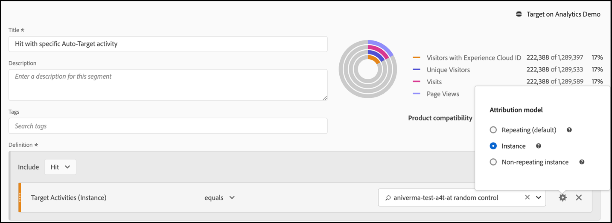

# Configuración de informes de A4T en Analysis Workspace para actividades [!DNL Auto-Target]

La integración de Analytics for Target (A4T) para actividades [!DNL Auto-Target] utiliza los algoritmos de aprendizaje automático (ML) del ensamblado de Adobe Target para elegir la mejor experiencia para cada visitante en función de su perfil, comportamiento y contexto, todo ello mientras utiliza una métrica de objetivo de Adobe Analytics.

Aunque las funciones de análisis enriquecidos están disponibles en Adobe Analytics Analysis Workspace, es necesario realizar algunas modificaciones en el panel predeterminado **[!UICONTROL Analytics for Target]** para interpretar correctamente las actividades [!DNL Auto-Target], debido a diferencias entre las actividades de experimentación (A/B manual y asignación automática) y las actividades de personalización ([!DNL Auto-Target]).

Este tutorial explica las modificaciones recomendadas para analizar las actividades [!DNL Auto-Target] en Workspace, que se basan en los siguientes conceptos clave:

* La dimensión **[!UICONTROL Control vs Targeted]** se puede utilizar para distinguir entre experiencias de control y las proporcionadas por el algoritmo ML del ensamblado [!DNL Auto-Target].
* Las visitas deben utilizarse como métrica de normalización cuando se vean desgloses de rendimiento en el nivel de experiencia. Además, la metodología de contabilización predeterminada de [Adobe Analytics puede incluir visitas en las que el usuario no ve realmente contenido de actividad](https://experienceleague.adobe.com/docs/target/using/integrate/a4t/a4t-faq/a4t-faq-viewing-reports.html?lang=en#metrics), pero este comportamiento predeterminado se puede modificar utilizando un segmento con ámbitos adecuados (detalles a continuación).
* La atribución de ámbitos de retrospectiva de visita (también conocida como la &quot;ventana de retrospectiva de visita&quot; en el modelo de atribución prescrito) la utilizan los modelos ML de Adobe Target durante sus fases de formación y se debe utilizar el mismo modelo de atribución (no predeterminado) al desglosar la métrica de objetivo.

## Creación del panel A4T para [!DNL Auto-Target] en Workspace

Para crear un informe de A4T para [!DNL Auto-Target], comience con el panel **[!UICONTROL Analytics para Target]** en Workspace, como se muestra a continuación, o comience con una tabla improvisada. A continuación, realice las siguientes selecciones:

1. **[!UICONTROL Experiencia]** de control: Puede elegir cualquier experiencia; sin embargo, anulará esta opción más adelante. Tenga en cuenta que para las actividades [!DNL Auto-Target], la experiencia de control es realmente una estrategia de control, que puede ser a) Servir aleatoriamente entre todas las experiencias o b) Servir una sola experiencia (esta opción se realiza en el momento de crear la actividad en Adobe Target). Incluso si ha elegido la opción (b) (su actividad [!DNL Auto-Target] designó una experiencia específica como Control), debe seguir el enfoque descrito en este tutorial para analizar A4T en actividades [!DNL Auto-Target].
2. **[!UICONTROL Métrica de normalización]**: Seleccione Visitas.
3. **[!UICONTROL Métricas de éxito]**: Aunque puede seleccionar cualquier métrica en la que desee informar, generalmente debe ver los informes sobre la misma métrica que se eligió para la optimización durante la creación de la actividad en Adobe Target.

*pngFigura 1: Configuración del panel Analytics for Target para  [!DNL Auto-Target] actividades.*

>[!NOTE]
>
>Para configurar el panel Analytics for Target para actividades de segmentación automática , elija cualquier experiencia de control, elija Visitas como métrica de normalización y elija la misma métrica de objetivo que se eligió para la optimización durante la creación de la actividad de Target.

## Utilice la dimensión Control vs. Targeted para comparar el modelo ML de ensamblado de Adobe Target con su control

El panel predeterminado de A4T está diseñado para pruebas A/B clásicas (manuales) o actividades de asignación automática, cuyo objetivo es comparar el rendimiento de experiencias individuales con la experiencia de control. En las actividades [!DNL Auto-Target], sin embargo, la primera comparación de pedidos debe ser entre Control *strategy* y la *estrategia* de destino (en otras palabras, determinar el alza del rendimiento general del modelo ML de ensamblado [!DNL Auto-Target] sobre la estrategia de control).

Para realizar esta comparación, utilice la dimensión **[!UICONTROL Control vs. Objetivos (Analytics para Target)]**. Arrastre y suelte para reemplazar la dimensión **[!UICONTROL Experiencias de Target]** en el informe A4T predeterminado.

Tenga en cuenta que esta sustitución invalida los cálculos predeterminados de Alza y confianza en el panel de A4T. Para evitar confusiones, puede eliminar estas métricas del panel predeterminado y dejar el siguiente informe:

*pngFigura 2: El informe de referencia recomendado para las  [!DNL Auto-Target] actividades. Este informe se ha configurado para comparar el tráfico segmentado (servido por el modelo ML del ensamblado) con el tráfico de Control.*

>[!NOTE]
>
>Actualmente, los números de Alza y Confianza no están disponibles para dimensiones de Control o Segmentación en informes de A4T para Segmentación automática. Hasta que no se agregue la compatibilidad, el alza y la confianza se pueden calcular manualmente descargando la [calculadora de confianza](https://experienceleague.adobe.com/docs/target/assets/complete_confidence_calculator.xlsx?lang=en).

## Agregar desgloses de métricas a nivel de experiencia

Para obtener más información sobre el rendimiento del modelo ML de ensamblado, puede examinar los desgloses de nivel de experiencia de la dimensión **[!UICONTROL Control vs. Targeted]**. En Workspace, arrastre la dimensión **[!UICONTROL Experiencias de Target]** al informe y, a continuación, desglose cada una de las dimensiones de Control y Segmentación por separado.

*pngFigura 3: Desglose de la dimensión objetivo por experiencias de Target*

Aquí se muestra un ejemplo del informe resultante.

*pngFigura 4: Un  [!DNL Auto-Target] informe estándar con desgloses de nivel de experiencia. Tenga en cuenta que la métrica de objetivo puede ser diferente y que la estrategia de control puede tener una sola experiencia.*

>[!TIP]
>
>En Workspace, haga clic en el icono de engranaje para ocultar los porcentajes en la columna Tasa de conversión y así mantener el foco en las tasas de conversión de la experiencia. Tenga en cuenta que las tasas de conversión tendrán un formato de decimales, pero las interpretarán como porcentajes según corresponda.

## Por qué &quot;Visitas&quot; es la métrica de normalización correcta para las actividades [!DNL Auto-Target]

Al analizar una actividad [!DNL Auto-Target], elija siempre Visitas como métrica de normalización predeterminada. [!DNL Auto-Target] personalización selecciona una experiencia para un visitante una vez por visita (formalmente, una vez por sesión de Adobe Target), lo que significa que la experiencia mostrada a un usuario puede cambiar en cada visita. Por lo tanto, si usa Visitantes únicos como métrica de normalización, el hecho de que un solo usuario termine viendo varias experiencias (en diferentes visitas) podría conllevar tasas de conversión confusas.

Un ejemplo sencillo demuestra este punto: considere un escenario en el que dos visitantes entren a una campaña que solo tenga dos experiencias. El primer visitante visita dos veces. Se les asigna la Experiencia A en la primera visita, pero la Experiencia B en la segunda visita (debido a que el estado de su perfil cambia en esa segunda visita). Después de la segunda visita, el visitante convierte realizando un pedido. La conversión se atribuye a la experiencia mostrada más recientemente (Experiencia B). El segundo visitante también visita dos veces y se muestra Experiencia B ambas veces, pero nunca convierte.

Permita comparar los informes de nivel de visitante y de nivel de visita:

| Experiencia | Visitantes únicos | Visitas | Conversiones | Norma de visitante. Conv. de pulsaciones | La norma de la visita. Conv. de pulsaciones |
| --- | --- | --- | --- | --- | --- |
| Una | 1 | 1 | - | 0% | 0% |
| B | 2 | 3 | 1 | 50% | 33,3 % |
| Totales | 2 | 4 | 1 | 50 % | 25 % |
*Tabla 1: Ejemplo que compara informes normalizados por visitantes con informes normalizados por visitas para un escenario en el que las decisiones se mantienen fieles a una visita (y no al visitante, como sucede con las pruebas A/B normales). Las métricas normalizadas por visitantes son confusas en este escenario.*

Como se muestra en la tabla, hay una clara incongruencia de los números de nivel de visitante. A pesar de que hay dos visitantes únicos totales, no se trata de una suma de visitantes únicos individuales para cada experiencia. Aunque la tasa de conversión a nivel de visitante no es necesariamente incorrecta, cuando se compara una experiencia individual, las tasas de conversión a nivel de visita probablemente tengan mucho más sentido. Formalmente, la unidad de análisis (&quot;visitas&quot;) es la misma que la unidad de adherencia en la toma de decisiones, lo que significa que se pueden agregar y comparar desgloses de métricas a nivel de experiencia.

## Filtro para visitas reales a la actividad

La metodología de contabilización predeterminada de Adobe Analytics para las visitas a una actividad de Target puede incluir las visitas en las que el usuario no interactuó con la actividad de Target. Esto se debe a la forma en que las asignaciones de actividades de Target se mantienen en el contexto de visitante de Analytics. Como resultado, el número de visitas a la actividad de Target a veces se puede aumentar, lo que resulta en una disminución de las tasas de conversión.

Si prefiere informar sobre las visitas en las que el usuario interactuó realmente con la actividad de segmentación automática (ya sea mediante la entrada en la actividad, un evento de visualización/visita o una conversión), puede:

1. Cree un segmento específico que incluya visitas de la actividad de Target en cuestión y, a continuación,
1. Filtre la métrica Visitas con este segmento.

**Para crear el segmento:**

1. Seleccione la opción **[!UICONTROL Componentes > Crear segmento]** en la barra de herramientas de Workspace.
2. Introduzca un **[!UICONTROL Título]** para el segmento. En el ejemplo que se muestra a continuación, el segmento se llama [!DNL "Hit with specific Auto-Target activity"].
3. Arrastre la dimensión **[!UICONTROL Actividades de Target]** a la sección **[!UICONTROL Definición]** del segmento.
4. Utilice el operador **[!UICONTROL equals]**.
5. Busque su actividad de Target específica.
6. Seleccione el icono de engranaje y seleccione **[!UICONTROL Attribution model > Instance]** como se muestra en la figura siguiente.
7. Haga clic en **[!UICONTROL Guardar]**.

*pngFigura 5: Utilice un segmento como el que se muestra aquí para filtrar la métrica Visitas de su  [!DNL Auto-Target] informe de A4T*

Una vez creado el segmento, utilícelo para filtrar la métrica Visitas, de modo que la métrica Visitas solo incluya las visitas en las que el usuario interactuó con la actividad de Target.

**Para filtrar Visitas con este segmento:**

1. Arrastre el segmento recién creado desde la barra de herramientas de componentes y pase el ratón por encima de la base de la etiqueta de métrica **[!UICONTROL Visitas]** hasta que aparezca un mensaje **[!UICONTROL Filtrar por]** azul.
2. Libere el segmento. El filtro se aplicará a esa métrica.

El panel final aparecerá de la siguiente manera.

*pngFigura 6: Panel de informes con el segmento &quot;Visita con actividad de segmentación automática específica&quot; aplicado a la   métrica Visitas. Esto garantiza que solo se incluyan en el informe las visitas en las que un usuario interactuó con la actividad de Target en cuestión.*

## Alinee la atribución entre la formación del modelo ML y la generación de métricas de objetivo

La integración de A4T permite que el modelo ML de [!DNL Auto-Target] esté *entrenado* utilizando los mismos datos de evento de conversión que Adobe Analytics utiliza para *generar informes de rendimiento*. Sin embargo, hay ciertas hipótesis que deben emplearse para interpretar estos datos al entrenar los modelos ML, que difieren de los supuestos predeterminados realizados durante la fase de notificación en Adobe Analytics.

Específicamente, los modelos ML de Adobe Target utilizan un modelo de atribución con ámbito de visita. Es decir, asumen que una conversión debe ocurrir en la misma visita como una visualización de contenido para la actividad, para que la conversión se &quot;atribuya&quot; a la decisión tomada por el modelo ML. Esto es necesario para que Target garantice la formación oportuna de sus modelos; Target no puede esperar hasta 30 días para una conversión (la ventana de atribución predeterminada para informes en Adobe Analytics) antes de incluirla en los datos de capacitación de sus modelos.

Por lo tanto, la diferencia entre la atribución utilizada por los modelos de Target (durante la formación) y la atribución predeterminada utilizada en la consulta de datos (durante la generación del informe) puede provocar discrepancias. Incluso puede parecer que los modelos ML tienen un rendimiento deficiente, cuando de hecho el problema reside en la atribución.

>[!TIP]
>
>Si los modelos ML están optimizando una métrica que se atribuye de forma diferente a la de las métricas que está viendo en un informe, es posible que los modelos no funcionen como se espera. Para evitarlo, asegúrese de que las métricas de objetivo del informe utilicen la misma atribución utilizada por los modelos ML de Target.

Para ver las métricas de objetivo que tienen la misma metodología de atribución utilizada por los modelos ML de Adobe Target, siga estos pasos:

1. Pase el ratón sobre el icono de engranaje de la métrica de objetivo:
   
1. Desde el menú resultante, desplácese hasta **[!UICONTROL Configuración de datos]**.
1. Seleccione **[!UICONTROL Usar modelo de atribución no predeterminado]** (si no está seleccionado):
   
1. Haga clic en **[!UICONTROL Editar]**.
1. Seleccione **[!UICONTROL Modelo]**: **[!UICONTROL Participación]** y **[!UICONTROL Ventana retrospectiva]**: **[!UICONTROL Visita]**.
   
1. Haga clic en **[!UICONTROL Aplicar]**. 

Estos pasos garantizan que el informe atribuirá la métrica de objetivo a la visualización de la experiencia, si el evento de métrica de objetivo se produjo *en cualquier momento* (&quot;participación&quot;) en la misma visita en la que se mostró una experiencia.

## Paso final: Cree una tasa de conversión que capture la magia de arriba

Con las modificaciones en las métricas de visitas y objetivos de las secciones anteriores, la modificación final que debe realizar en el panel de informes predeterminado de A4T para [!DNL Auto-Target] es crear tasas de conversión que sean la proporción correcta (la de una métrica de objetivos con la atribución correcta) y una métrica de &quot;Visitas&quot; debidamente filtrada.

Para ello, cree una métrica calculada siguiendo los pasos siguientes:

1. Seleccione la opción **[!UICONTROL Componentes > Crear métrica]** en la barra de herramientas de Workspace.
1. Introduzca un **[!UICONTROL Título]** para la métrica. Por ejemplo, &quot;Tasa de conversión corregida por la visita para la actividad XXX&quot;.
1. Seleccione **[!UICONTROL Formato]** = Porcentaje y **[!UICONTROL Lugares decimales]** = 2.
1. Arrastre la métrica de objetivo correspondiente a su actividad (por ejemplo, Conversiones de actividad) a la definición y utilice el icono de engranaje de esta métrica de objetivo para ajustar el modelo de atribución a (Participación|Visita), como se describió anteriormente.
1. Seleccione **[!UICONTROL Add > Container]** en la parte superior derecha de la sección **[!UICONTROL Definition]**.
1. Seleccione el operador de división () entre los dos contenedores.
1. Arrastre el segmento creado anteriormente (denominado &quot;Visita con actividad [!DNL Auto-Target] específica&quot; en este tutorial) para esta actividad [!DNL Auto-Target] específica.
1. Arrastre la métrica **[!UICONTROL Visitas]** al contenedor de segmentos.
1. Haga clic en **[!UICONTROL Guardar]**.

La definición completa de la métrica calculada se muestra aquí.

*pngFigura 7: La definición de métrica de tasa de conversión del modelo corregida por la visita y la atribución. (Tenga en cuenta que esta métrica depende de la métrica y la actividad de objetivos. En otras palabras, esta definición de métrica no se puede reutilizar en todas las actividades.)*

>[!IMPORTANT]
>
>La métrica Tasa de conversión del panel de A4T no está vinculada al evento de conversión ni a la métrica de normalización de la tabla. Al realizar las modificaciones sugeridas en este tutorial, la tasa de conversión no se adapta automáticamente a los cambios. Por lo tanto, si realiza la modificación a una (o ambas) atribución de evento de conversión y a la métrica de normalización, debe recordar como último paso para modificar también la tasa de conversión, como se muestra arriba.

## Resumen: Panel de espacio de trabajo de muestra final para informes [!DNL Auto-Target]

Al combinar todos los pasos anteriores en un solo panel, la figura siguiente muestra una vista completa del informe recomendado para las actividades de A4T [!DNL Auto-Target]. Este informe es el mismo que el utilizado por los modelos de aprendizaje automático de Target para optimizar la métrica de objetivos e incorpora todos los matices y recomendaciones que se tratan en este tutorial. Este informe es también el más cercano a las metodologías de contabilización utilizadas en las actividades [!DNL Auto-Target] tradicionales de informes de Target.

*pngFigura 8: El  [!DNL Auto-Target] informe final de A4T en Adobe Analytics Workspace, que combina todos los ajustes a las definiciones de métricas descritas en las secciones anteriores de este documento.*
