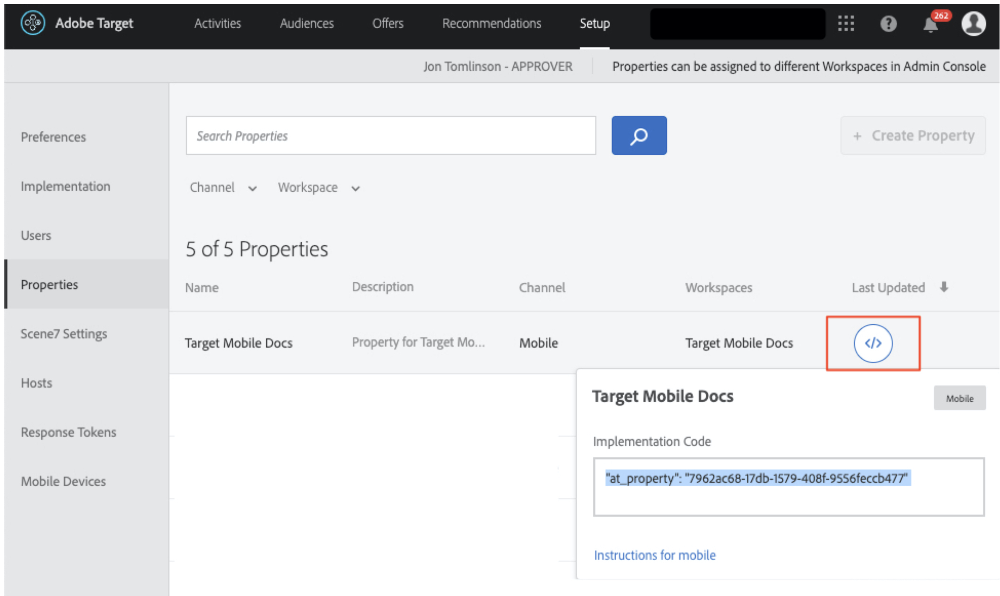
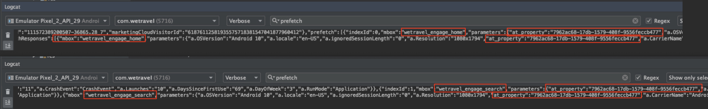

# Añadir parámetros a las solicitudes

En esta lección, agregaremos métricas del ciclo vital del Adobe y parámetros personalizados a las [!DNL Target] solicitudes agregadas en la lección anterior. Estas métricas y parámetros se utilizarán para crear audiencias personalizadas más adelante en el tutorial.

## Objetivos de aprendizaje

Al final de esta lección, podrá:

* Agregar las métricas del ciclo vital móviles de Adobe
* Añadir parámetros a una solicitud de recuperación previa
* Añadir parámetros a una ubicación activa
* Validación de los parámetros de ambas solicitudes

## Añadir los parámetros del ciclo vital

Habilitemos el [Adobe de métricas del ciclo vital móvil](https://docs.adobe.com/content/help/en/mobile-services/android/metrics.html). Esto agregará parámetros a las solicitudes de ubicación que contengan información enriquecida sobre el dispositivo del usuario y la participación en la aplicación. Generaremos audiencias en la siguiente lección utilizando los datos que proporciona la solicitud de ciclo vital.

Para habilitar las métricas del ciclo vital, vuelva a abrir el controlador HomeActivity y añada `Config.collectLifecycleData(this);` a la función onResume() :


### Validación de los parámetros del ciclo vital para la solicitud de recuperación previa

Ejecute el emulador y utilice Logcat para validar los parámetros del ciclo vital. Filtre por &quot;recuperación previa&quot; para encontrar la respuesta de recuperación previa y buscar los nuevos parámetros:


Aunque solo hemos agregado `Config.collectLifecycleData()` al controlador de HomeActivity, también debería ver las métricas del ciclo vital enviadas con la solicitud de Target en la pantalla de agradecimiento.

## Agregar el parámetro at_property a la solicitud de recuperación previa

Las propiedades de Adobe Target se definen en la interfaz [!DNL Target] y se utilizan para establecer límites para personalizar aplicaciones y sitios web. El parámetro at_property identifica la propiedad específica en la que se accede a las ofertas y actividades y se las mantiene. Agregue una propiedad a las solicitudes de recuperación previa y ubicación activa.

>[!NOTE]
>
>Puede que vea o no las opciones de Propiedades en la interfaz [!DNL Target] , según la licencia. Si no tiene estas opciones o si no utiliza Propiedades en su empresa, vaya a la siguiente sección de esta lección.

Puede recuperar el valor at_property en la interfaz [!DNL Target] en [!UICONTROL Configuración] > [!UICONTROL Propiedades].  Pase el ratón sobre la propiedad, seleccione el icono de fragmento de código y copie el valor `at_property` :



Añádalo como un parámetro para cada ubicación en la solicitud de recuperación previa de esta manera:

Este es el código actualizado para la función `targetPrefetchContent()` (asegúrese de actualizar el _[!UICONTROL su valor at_property va aquí]_ texto del marcador de posición!):

```java
public void targetPrefetchContent() {
        List<TargetPrefetchObject> prefetchList = new ArrayList<>();

        Map<String, Object> params1;
        params1 = new HashMap<String, Object>();
        params1.put("at_property", "your at_property value goes here");

        prefetchList.add(Target.createTargetPrefetchObject(Constant.wetravel_engage_home, params1));
        prefetchList.add(Target.createTargetPrefetchObject(Constant.wetravel_engage_search, params1));
        Target.TargetCallback<Boolean> prefetchStatusCallback = new Target.TargetCallback<Boolean>() {
            @Override
            public void call(final Boolean status) {
                HomeActivity.this.runOnUiThread(new Runnable() {
                    @Override
                    public void run() {
                        String cachingStatus = status ? "YES" : "NO";
                        System.out.println("Received Response from prefetch : " + cachingStatus);
                        engageMessage();
                        setUp();

                    }
                });
            }};
        Target.prefetchContent(prefetchList, null, prefetchStatusCallback);
    }
```

### Nota sobre los parámetros

Para futuros proyectos, es posible que desee implementar parámetros adicionales. El método `createTargetPrefetchObject()` permite tres tipos de parámetros: `locationParams`, `orderParams` y `productParams`. Consulte la documentación para obtener [más detalles sobre cómo agregar estos parámetros a la solicitud de recuperación previa](https://experienceleague.adobe.com/docs/mobile-services/android/target-android/c-mob-target-prefetch-android.html?lang=en).

Tenga en cuenta también que se pueden agregar diferentes parámetros de ubicación a cada ubicación en la solicitud de recuperación previa. Por ejemplo, puede crear otro Mapa llamado param2, colocar un nuevo parámetro en él y luego configurar param2 en una ubicación y param1 con la otra ubicación. Este es un ejemplo:

```java
prefetchList.add(Target.createTargetPrefetchObject(location1_name, params1);
prefetchList.add(Target.createTargetPrefetchObject(location2_name, params2);
```

## Validar el parámetro at_property en la solicitud de recuperación previa

Ejecute el emulador y utilice Logcat para verificar que se muestra at_property en la solicitud de recuperación previa y en la respuesta para ambas ubicaciones:


## Añadir parámetros personalizados a la solicitud de ubicación activa

La solicitud de ubicación activa (wetravel_context_dest) se agregó en la lección anterior para que pudiéramos mostrar una promoción relevante en la pantalla de confirmación final del proceso de reserva. Nos gustaría personalizar la promoción en función del destino del usuario y para ello agregaremos eso como parámetro a la solicitud. También agregaremos un parámetro para el origen trop y el valor at_property .

Añada los siguientes parámetros a la función targetLoadRequest() en el controlador thankYouActivity:

Este es el código actualizado para la función targetLoadRequest() (asegúrese de actualizar el texto del marcador de posición &quot;añadir el valor de at_property aquí&quot;):

```java
public void targetLoadRequest(final ArrayList<Recommandation> recommandations) {
    Map<String, Object> locationParams = new HashMap<>();
    locationParams.put("at_property","add your at_property value here");
    locationParams.put("locationSrc", (""+Utility.getInSharedPreference(ThankYouActivity.this,Constant.departure,"")));
    locationParams.put("locationDest", (""+Utility.getInSharedPreference(ThankYouActivity.this,Constant.destination,"")));

    Target.loadRequest(Constant.wetravel_context_dest, "", null, null, locationParams, new Target.TargetCallback<String>() {
        @Override
        public void call(final String response) {
        try {
            runOnUiThread(new Runnable() {
                @Override
                public void run() {
                    AppDialogs.dialogLoaderHide();
                    filterRecommendationBasedOnOffer(recommandations, response);
                    recommandationbAdapter.notifyDataSetChanged();
                }
            });
        } catch (Exception e) {
            e.printStackTrace();
        }
        }
    });
    Target.clearPrefetchCache();
}
```

### Validación de los parámetros personalizados en la solicitud de ubicación activa

Ejecute el emulador y abra Logcat. Filtre por uno de los parámetros para verificar que la solicitud contiene los parámetros necesarios:


>[!NOTE]
>
>Solicitudes y parámetros de confirmación de pedido: Aunque no se usa en este proyecto de demostración, los detalles de los pedidos generalmente se capturan en una implementación real, por lo que [!DNL Target] puede utilizar los detalles de los pedidos como métricas/dimensiones. Consulte la documentación para obtener instrucciones sobre cómo [implementar la solicitud de confirmación de pedido y los parámetros](https://experienceleague.adobe.com/docs/mobile-services/android/target-android/c-target-methods.html?lang=en).

>[!NOTE]
>
>Analytics for Target (A4T): Adobe Analytics se puede configurar como fuente de informes para [!DNL Target]. Esto permite ver en Adobe Analytics todas las métricas y dimensiones recopiladas por el SDK de Target. Consulte [Información general de A4T](https://experienceleague.adobe.com/docs/target/using/integrate/a4t/a4t.html?lang=en) para obtener más información.

¡Buen trabajo! Ahora que los parámetros están establecidos, estamos listos para usar esos parámetros para crear audiencias y ofertas en Adobe Target.

**[SIGUIENTE : &quot;Crear audiencias y ofertas&quot; >](create-audiences-and-offers.md)**
