# Crear audiencias y ofertas en Adobe Target

En esta lección, entraremos en la interfaz de [!DNL Target] y crearemos audiencias y ofertas para las tres ubicaciones que implementamos en las lecciones anteriores.

## Objetivos de aprendizaje

Al final de esta lección, podrá hacer lo siguiente:

* Cree públicos en Adobe Target
* Creación de ofertas en Adobe Target

Más específicamente, en esta lección crearemos audiencias y ofertas necesarias para lograr los casos de uso de personalización definidos al principio del tutorial. Queremos usar las pantallas de Inicio y Búsqueda para ayudar a los usuarios de la aplicación a reservar sus viajes, y queremos usar la pantalla de agradecimiento para mostrar algunas promociones relevantes basadas en el destino del usuario. Esta es una tabla que representa lo que vamos a generar en esta lección para cada ubicación:

| Ubicación | Público | Oferta |
| --- | --- | --- |
| wetravel_engage_home | Nuevos usuarios de aplicaciones móviles | &quot;Seleccione su origen y destino para buscar rutas de autobús disponibles&quot; |
| wetravel_engage_search | Nuevos usuarios de aplicaciones móviles | &quot;Utilice los filtros para reducir los resultados de búsqueda&quot; |
| wetravel_engage_home | Devolución de usuarios de aplicaciones móviles | &quot;¡Bienvenido de nuevo! Utilice el código de promoción BACK30 durante el cierre de compra para obtener un descuento del 10%&quot;. |
| wetravel_engage_search | Devolución de usuarios de aplicaciones móviles | contenido predeterminado |
| wetravel_context_dest | Destino: San Diego | &quot;DJ&quot; |
| wetravel_context_dest | Destino: Los Ángeles | &quot;Universal&quot; |

## Seleccione Su Workspace

Si su empresa utiliza propiedades y espacios de trabajo para establecer límites para personalizar aplicaciones y sitios web (y ha implementado el parámetro at_property en la última lección), primero debe asegurarse de que está en la Workspace correcta antes de continuar con esta lección. Si no utiliza Propiedades y Espacios de trabajo, ignore este paso. Seleccione la Workspace que utilizó en la lección anterior para copiar el valor at_property:

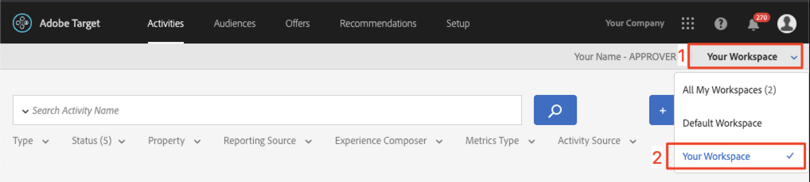

## Crear audiencias

Ahora vamos a crear las audiencias que utilizaremos para personalizar la aplicación.

### Crear una audiencia para usuarios nuevos

Las audiencias de Adobe Target se utilizan para identificar grupos específicos de visitantes. Las ofertas se pueden dirigir a esos grupos específicos. Para las dos primeras ubicaciones, se utiliza la audiencia &quot;Nuevos usuarios&quot;:

1. Haga clic en **[!UICONTROL Audiencias]** en la barra de navegación superior.
1. Haga clic en el botón **[!UICONTROL Crear audiencia]**.
   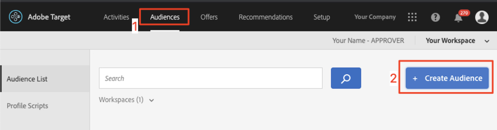

1. Escriba **[!UICONTROL Nuevos usuarios de aplicaciones móviles]** como nombre de audiencia.
1. Seleccione **[!UICONTROL Agregar regla]**.
1. Seleccione una regla **[!UICONTROL Custom]**.
   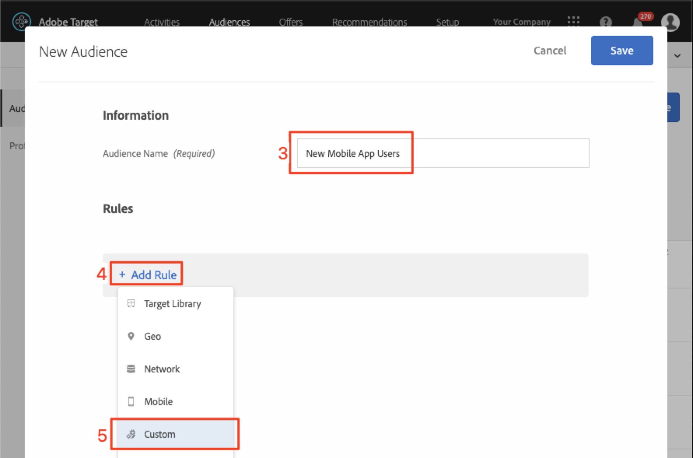

1. Seleccione **[!UICONTROL a.Launches]**.
1. Seleccionar **[!UICONTROL es menor que]**.
1. Escriba **5**.
1. Guarde la nueva audiencia.
   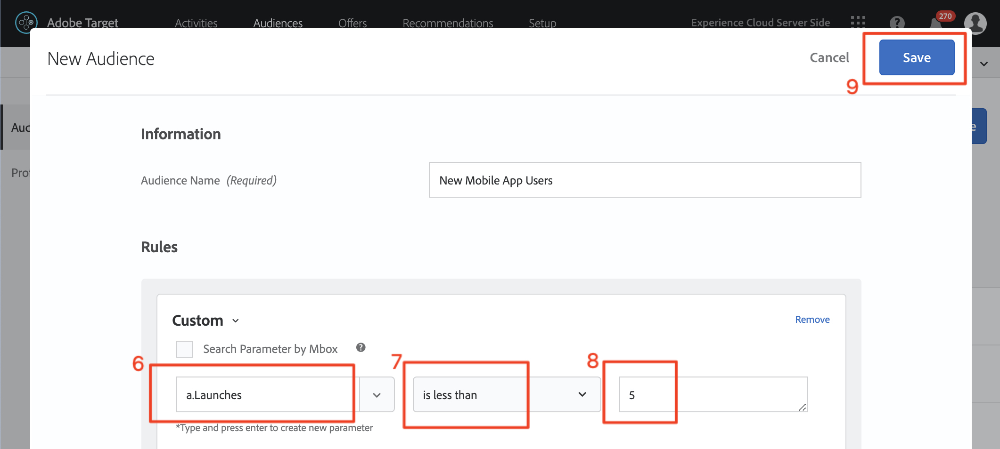

### Crear una audiencia para los usuarios que regresan

Siga los mismos pasos enumerados anteriormente para crear una audiencia para los usuarios que regresan.

1. Asigne un nombre a la audiencia _Usuarios de aplicaciones móviles que regresan_.
1. Usar **[!UICONTROL a.Lanzamientos mayores o iguales a 5]** como regla personalizada.
1. Guarde la nueva audiencia.

   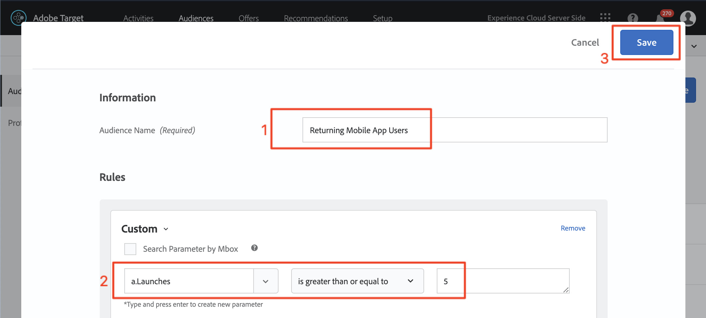

>[!NOTE]
>
>Todas las métricas y dimensiones del ciclo vital recopiladas en el SDK móvil [!DNL Target] van precedidas de &quot;a&quot; (por ejemplo, a.Launches), están disponibles en la opción &quot;Personalizado&quot; del menú desplegable y se pueden usar para generar audiencias.

### Crear una audiencia para los usuarios que reservan un viaje a San Diego

A continuación, crearemos algunas audiencias para algunos de los destinos ofrecidos por la aplicación We.Travel. En la última lección pasamos el destino como parámetro de ubicación en la solicitud de ubicación wetravel_context_dest. Ese parámetro está disponible en la opción &quot;Personalizado&quot; del menú desplegable.

>[!NOTE]
>
>Si un parámetro que espera ver en la lista desplegable Personalizado no aparece en la interfaz [!DNL Target], compruebe que realmente se esté pasando en la solicitud. Si ha comprobado que está en la solicitud, pero que no se ha cargado de forma diferida en la interfaz [!DNL Target], solo puede escribir el nombre del parámetro y pulsar Intro para continuar definiendo la audiencia

1. Asigne un nombre a la audiencia _Destino: San Diego_.
1. Use una regla personalizada con esta definición: _locationDest contiene San Diego_.
1. Guarde la nueva audiencia.

   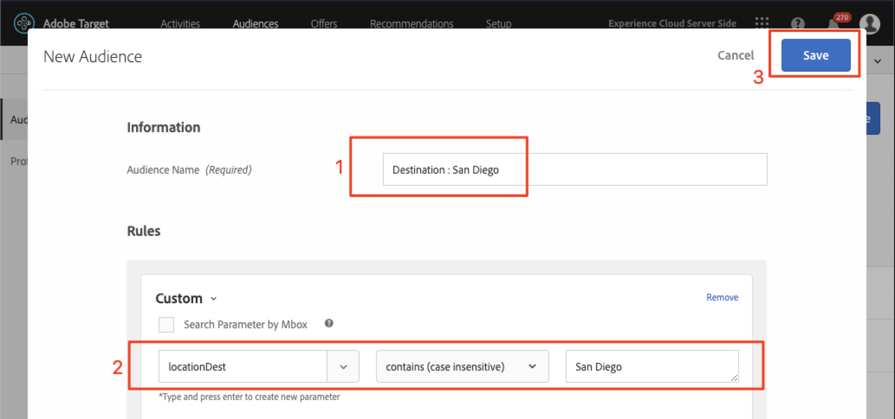

### Crear una audiencia para usuarios que reservan un viaje a Los Ángeles

1. Asigne un nombre a la audiencia _Destino: Los Ángeles_
1. Use una regla personalizada con esta definición: _locationDest contiene Los Ángeles_
1. Guarde la nueva audiencia.

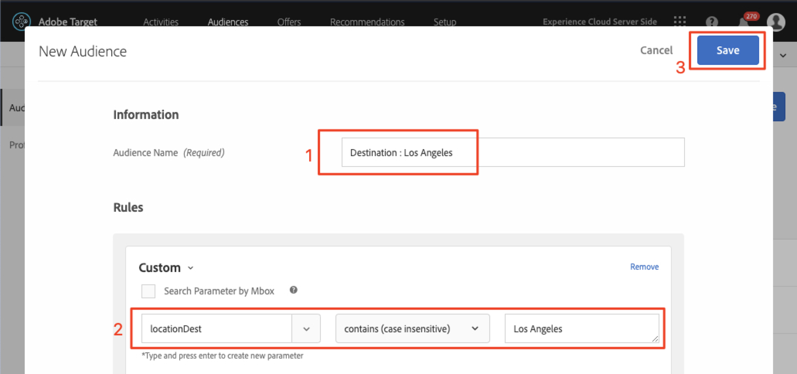

## Crear ofertas

Ahora, vamos a crear ofertas para mostrar estos mensajes. Como recordatorio, las ofertas son fragmentos de código/contenido que se entregan en la respuesta [!DNL Target]. La mayoría de las veces se crean en la interfaz de usuario de [!DNL Target], pero también se pueden crear mediante API o mediante la integración de fragmentos de experiencias con Adobe Experience Manager. En las aplicaciones móviles, las ofertas JSON son comunes. En este tutorial, utilizaremos ofertas de HTML, que se pueden utilizar para entregar cualquier contenido de texto sin formato (incluido JSON) en la aplicación.

### Creación de la oferta para nuevos usuarios

En primer lugar, vamos a crear ofertas para los mensajes a los nuevos usuarios:

1. Haga clic en **[!UICONTROL Ofertas]** en la barra de navegación superior.
1. Haga clic en **[!UICONTROL Crear]**.
1. Seleccione **[!UICONTROL Oferta de HTML]**.

   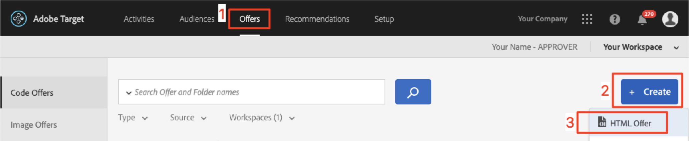

1. Asigne un nombre a la oferta _Home: Engage New Users_.
1. Escriba _Seleccionar Source y destino para buscar los buses disponibles_ como código.
1. Guarde la nueva oferta.

   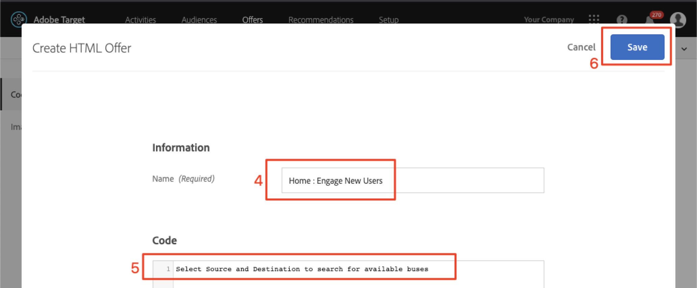

### Creación de la oferta para usuarios que regresan

Ahora vamos a crear la única oferta para los usuarios que regresan (la segunda oferta será el contenido predeterminado, que se mostrará como nada):

1. Asigne un nombre a la oferta _Inicio: Usuarios que regresan_.
1. Ingresa _Bienvenido de nuevo. Use el código de promoción BACK30 durante el cierre de compra para obtener un descuento del 10%._ como código HTML.
1. Guarde la nueva oferta.

   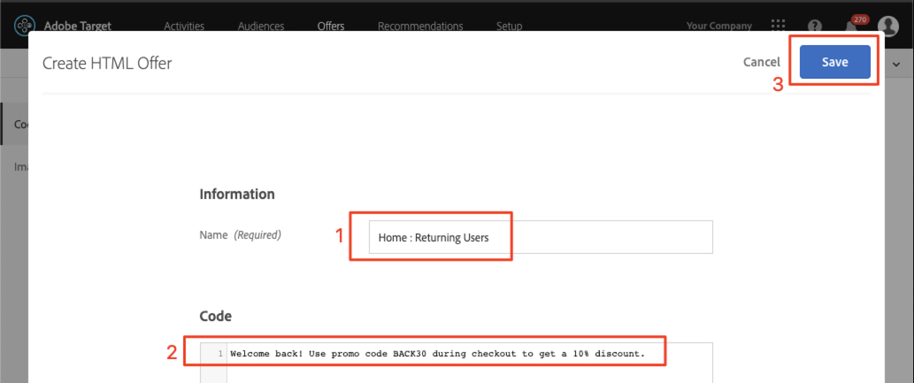

### Creación de la oferta de San Diego

Cuando &quot;DJ&quot; vuelve a la actividad de agradecimiento, la lógica de la función filterRecommendationsBasedOnOffer() muestra un banner para &quot;Rock Night with DJ SAM&quot;:

1. Asigne un nombre a la oferta _Promoción para San Diego_.
1. Escriba _DJ_ como código de HTML.
1. Guarde la nueva oferta.

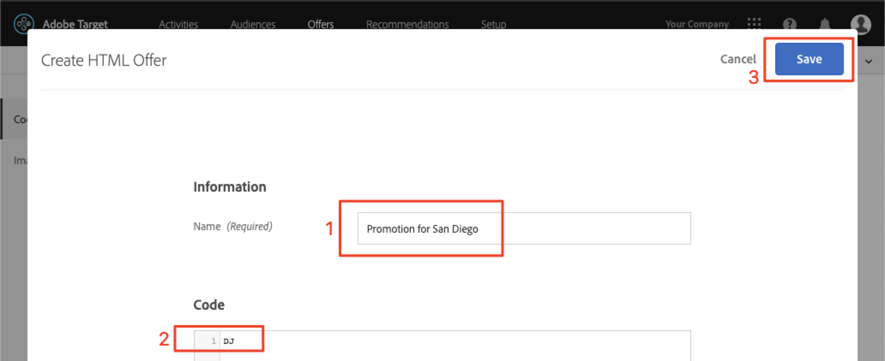

### Crear oferta para usuarios que van a Los Ángeles

Cuando se devuelve &quot;Universal&quot; a la actividad de agradecimiento, se muestra la lógica de la función filterRecommendationsBasedOnOffer() con un titular para &quot;Universal Studios&quot;:

1. Asigne un nombre a la oferta _Promoción para Los Ángeles_.
1. Escriba _Universal_ como código de HTML.
1. Guarde la nueva oferta.

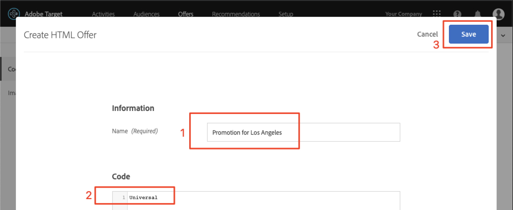

## Conclusión

Ahora tenemos nuestras audiencias y ofertas. En la siguiente lección, crearemos actividades que unen las ubicaciones, las audiencias y las ofertas para crear experiencias personalizadas.

**[SIGUIENTE: &quot;Personalizar diseños&quot; >](personalize-layouts.md)**
