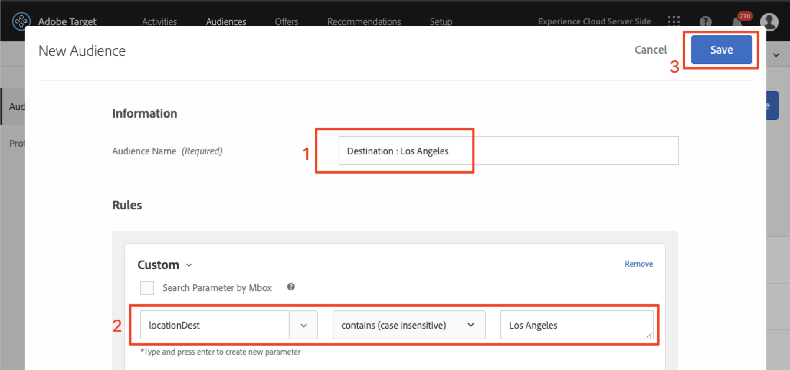

# Crear Audiencias y Ofertas en Adobe Target

En esta lección, vamos a entrar en la interfaz [!DNL Target] y construir audiencias y ofertas para las tres ubicaciones que implementamos en las lecciones anteriores.

## Objetivos de aprendizaje

Al final de esta lección, podrá:

* Cree audiencias en Adobe Target
* Crear ofertas en Adobe Target

Más específicamente, en esta lección crearemos audiencias y ofertas necesarias para realizar los casos de uso de personalización definidos al principio del tutorial. Queremos utilizar las pantallas Inicio y Búsqueda para ayudar a los usuarios de la aplicación a reservar sus viajes y queremos utilizar la pantalla de agradecimiento para mostrar algunas promociones relevantes basadas en el destino del usuario. Esta es una tabla que representa lo que vamos a crear en esta lección para cada ubicación:

| Ubicación | Audiencia | Oferta |
| --- | --- | --- |
| wetravel_engagement_home | Nuevos usuarios de aplicaciones móviles | &quot;Seleccione su Origen y destino para buscar las rutas de bus disponibles&quot; |
| wetravel_engagement_search | Nuevos usuarios de aplicaciones móviles | &quot;Use filtros para reducir los resultados de búsqueda&quot; |
| wetravel_engagement_home | Devolución de usuarios de aplicaciones móviles | &quot;¡Bienvenido de nuevo! Utilice el código de promoción BACK30 durante el cierre de compra para obtener un descuento del 10 %&quot;. |
| wetravel_engagement_search | Devolución de usuarios de aplicaciones móviles | contenido predeterminado |
| wetravel_context_dest | Destino: San Diego | &quot;DJ&quot; |
| wetravel_context_dest | Destino: Los Ángeles | &quot;Universal&quot; |

## Seleccione su espacio de trabajo

Si su compañía utiliza Propiedades y espacios de trabajo para establecer límites para personalizar aplicaciones y sitios web (e implementó el parámetro at_property en la última lección), primero debe asegurarse de que está en el espacio de trabajo correcto antes de continuar con esta lección. Si no utiliza Propiedades y espacios de trabajo, simplemente ignore este paso. Seleccione el espacio de trabajo que utilizó en la lección anterior para copiar el valor de at_property:

## Crear Audiencias

Ahora vamos a crear las audiencias que usaremos para personalizar la aplicación.

### Crear una Audiencia para nuevos usuarios

Las Audiencias de Adobe Target se utilizan para identificar grupos específicos de visitantes. Las ofertas se pueden dirigir a esos grupos específicos. Para las dos primeras ubicaciones, utilizaremos una audiencia &quot;Nuevos usuarios&quot;:

1. Haga clic en **[!UICONTROL Audiencias]** en la navegación superior.
1. Haga clic en el botón **[!UICONTROL Crear Audiencia]**.
   

1. Escriba **[!UICONTROL Nuevos usuarios de aplicaciones móviles]** como nombre de audiencia.
1. Seleccione **[!UICONTROL Añadir regla]**.
1. Seleccione una regla **[!UICONTROL Personalizada]**.
   

1. Seleccione **[!UICONTROL a.Launches]**.
1. Seleccionar **[!UICONTROL es menor que]**.
1. Introduzca **5**.
1. Guarde la nueva audiencia.
   

### Crear una Audiencia para usuarios que regresan

Siga los mismos pasos enumerados anteriormente para crear una audiencia para los usuarios que regresan.

1. Asigne un nombre a la audiencia _Devolución de usuarios de aplicaciones móviles_.
1. Usar **[!UICONTROL a.Launches es bueno o igual a 5]** como regla personalizada.
1. Guarde la nueva audiencia.

   

>[!NOTE]
>
>Todas las métricas y dimensiones del ciclo vital recopiladas en el [!DNL Target] SDK móvil van precedidas de &quot;a&quot; (por ejemplo, a.Launches) y están disponibles en la opción &quot;Personalizado&quot; del menú desplegable y se pueden utilizar para generar audiencias.

### Crear una Audiencia para los usuarios que reserven un viaje a San Diego

A continuación, crearemos algunas audiencias para algunos de los destinos ofrecidos por la aplicación We.Travel. En la última lección pasamos el destino como parámetro de ubicación en la solicitud de ubicación wetravel_context_dest. Ese parámetro está disponible en la opción &quot;Personalizado&quot; del menú desplegable.

>[!NOTE]
>
>Si un parámetro que espera ver en el menú desplegable Personalizado no aparece en la interfaz [!DNL Target], compruebe con doble que se esté pasando en la solicitud. Si ha comprobado que está en la solicitud, pero no se ha cargado de forma diferida en la interfaz [!DNL Target], sólo puede escribir el nombre del parámetro y pulsar Intro para continuar definiendo la audiencia

1. Asigne un nombre a la audiencia _Destino: San Diego_.
1. Utilice una regla personalizada con esta definición: _locationDest contiene San Diego_.
1. Guarde la nueva audiencia.

   

### Crear una Audiencia para los usuarios que reserven un viaje a Los Ángeles

1. Asigne un nombre a la audiencia _Destino: Los Ángeles_
1. Utilice una regla personalizada con esta definición: _locationDest contiene Los Ángeles_
1. Guarde la nueva audiencia.

## Creación de ofertas

Ahora, vamos a crear ofertas para mostrar estos mensajes. Como recordatorio, las ofertas son fragmentos de código/contenido que se entregan en la respuesta [!DNL Target]. Generalmente se crean en la interfaz de usuario [!DNL Target], pero también se pueden crear mediante API o mediante la integración de fragmentos de experiencia con Adobe Experience Manager. En las aplicaciones móviles, las ofertas JSON son comunes. En este tutorial, utilizaremos ofertas HTML, que se pueden utilizar para distribuir contenido de texto sin formato (incluido JSON) en la aplicación.

### Crear la Oferta para nuevos usuarios

Primero, creemos ofertas para los mensajes a Nuevos usuarios:

1. Haga clic en **[!UICONTROL Ofertas]** en la navegación superior.
1. Haga clic en **[!UICONTROL Crear]**.
1. Seleccione **[!UICONTROL Oferta HTML]**.

   

1. Asigne un nombre a la oferta _Inicio: Participación de nuevos usuarios_.
1. Escriba _Seleccione Origen y Destino para buscar buses disponibles_ como código.
1. Guarde la nueva oferta.

   

### Crear la Oferta para los usuarios que regresan

Ahora vamos a crear la oferta única para los usuarios que regresan (la segunda oferta será el contenido predeterminado, que se mostrará como nada):

1. Asigne un nombre a la oferta _Inicio: Usuarios que regresan_.
1. Escriba _Bienvenido de nuevo. Utilice el código de promoción BACK30 durante el cierre de compra para obtener un descuento del 10 %._ como código HTML.
1. Guarde la nueva oferta.

   

### Crear la Oferta de San Diego

Cuando se devuelve &quot;DJ&quot; a la actividad de agradecimiento, la lógica de la función filterRecommendationsBasedOnOffer() mostrará un letrero para &quot;Rock Night with DJ SAM&quot;:

1. Asigne un nombre a la oferta _Promoción para San Diego_.
1. Introduzca _DJ_ como código HTML.
1. Guarde la nueva oferta.

### Crear Oferta para los usuarios que van a Los Ángeles

Cuando se devuelve &quot;Universal&quot; a la actividad de agradecimiento, la lógica de la función filterRecommendationsBasedOnOffer() mostrará una pancarta para &quot;Universal Studios&quot;:

1. Asigne un nombre a la oferta _Promoción para Los Ángeles_.
1. Escriba _Universal_ como código HTML.
1. Guarde la nueva oferta.

## Conclusión. 

Ahora tenemos nuestras Audiencias y Ofertas. En la siguiente lección, crearemos actividades que unirán ubicaciones, audiencias y ofertas para crear experiencias personalizadas.

**[SIGUIENTE: &quot;Personalizar diseños&quot; >](personalize-layouts.md)**
