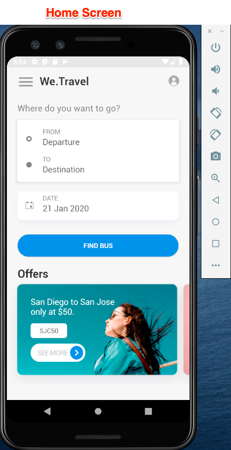

# Descargue y actualice la aplicación de ejemplo We.Travel.

La aplicación de ejemplo We.Travel está preimplementada con el SDK v4 de Adobe Mobile Services. Solo tiene que actualizarlo, de modo que señale a sus propias cuentas de organización de Experience Cloud y de solución.

## Objetivos de aprendizaje

Al final de esta lección, podrá hacer lo siguiente:

* Descargue y abra la aplicación de ejemplo We.Travel en Android Studio.
* Verificar y actualizar la configuración del SDK de Mobile Services para [!DNL Target]

## Descargue la aplicación We.Travel

* Descargar [sample-app-android-SDKv4-Base-Version.zip](assets/sample-app-android-SDKv4-Base-Version.zip)
* Descomprima el archivo zip
* Abra la aplicación en Android Studio como un proyecto existente (ignore cualquier error sobre &quot;Asignación raíz de VCS no válida&quot;)
* Ejecute la aplicación en un emulador para confirmar que la aplicación se compila y puede ver la pantalla de inicio
* Examine la aplicación y verifique que puede completar el proceso de reserva (seleccione cualquier opción de pago y simplemente pulse &quot;Continuar&quot; para saltar la pantalla de facturación).

  

## Verificar y actualizar la configuración del SDK de Mobile Services para [!DNL Target]

El SDK de Adobe Mobile Services se ha preinstalado en la aplicación We.Travel [según la documentación](https://experienceleague.adobe.com/docs/mobile-services/android/getting-started-android/requirements.html?lang=en). Ahora actualizará la instalación para que apunte a su propia cuenta de [!DNL Target].

En primer lugar, cree una nueva aplicación en la interfaz de usuario de Mobile Services:

1. Inicie sesión en la [interfaz de Adobe Mobile Services](https://mobilemarketing.adobe.com/).
1. Vaya a [!UICONTROL Manage Apps] y, a continuación, haga clic en **[!UICONTROL Add]** para agregar una aplicación nueva y utilizarla con este tutorial (**[!UICONTROL Manage Apps]** > **[!UICONTROL Add]**).
1. Elija un grupo de informes de Analytics con datos que no sean de producción, asigne un nombre a la aplicación, seleccione el tipo **[!UICONTROL Standard]** y haga clic en **[!UICONTROL Save]**.
1. Una vez agregada la aplicación, agregue el código de cliente [!DNL Target] en la siguiente pantalla de la sección [!UICONTROL SDK Target Options] (puede encontrar el código de cliente en la interfaz [!DNL Target], en **[!UICONTROL Setup]** > **[!UICONTROL Implementation]** > **[!UICONTROL Edit Settings]**, junto al botón Descargar `at.js`).
1. La configuración [!UICONTROL Request Timeout] determina cuánto tiempo espera la aplicación la respuesta del servidor [!DNL Target] antes de ejecutar las instrucciones de tiempo de espera. Deje la configuración predeterminada.
1. Habilite [!UICONTROL Visitor ID Service] y asegúrese de que su [!UICONTROL Organization] esté seleccionado en la lista desplegable.
1. Guarde los cambios haciendo clic en **[!UICONTROL Save]** en la parte superior derecha de la ventana (no en la sección [!UICONTROL Universal Links], [!UICONTROL App Links] o [!UICONTROL Push Services]).
1. Desplácese a la sección Descargas del SDK de la aplicación en la parte inferior de la página y descargue el archivo de configuración:

   

1. Reemplace el archivo `ADBMobileConfig.json` en la carpeta de recursos del proyecto de Android Studio (app > src > main > assets).

1. Ahora abra el archivo `ADBMobileConfig.json` y asegúrese de que contiene los cambios esperados, como el código de cliente [!DNL Target] y los detalles de Analytics:
   

Si no ve su configuración, confirme que ha hecho clic en el botón derecho **[!UICONTROL Save]** en la interfaz [!UICONTROL Mobile Services] y que ha copiado el archivo en la ubicación correcta.

¡Felicidades! ¡Ha actualizado el SDK con los detalles de su cuenta de [!DNL Target]! Haremos una validación adicional de la configuración después de agregar [!DNL Target] solicitudes en la siguiente lección.

**[SIGUIENTE: &quot;Agregar solicitudes de Target&quot; >](add-requests.md)**
