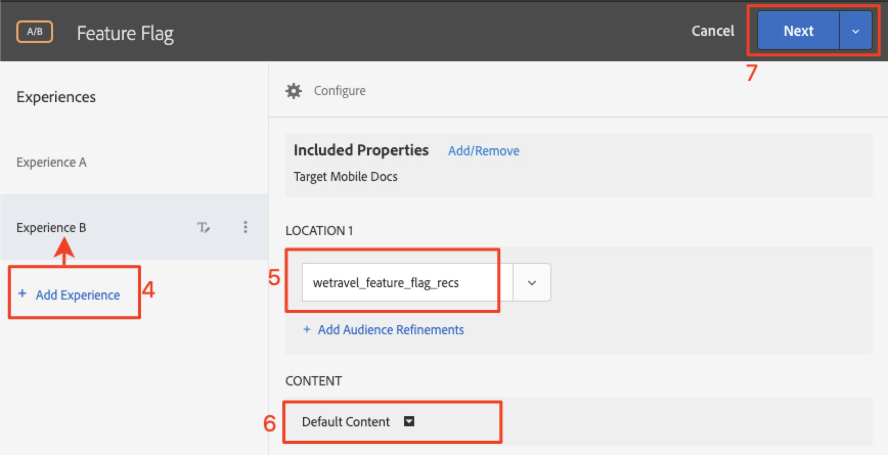

# Marcado de funciones

Los propietarios de productos de aplicaciones móviles necesitan la flexibilidad para desplegar nuevas funciones en su aplicación sin tener que invertir en varias versiones de la aplicación. También es posible que deseen desplegar las funciones gradualmente a un porcentaje de la base de usuarios para comprobar la eficacia. Adobe Target se puede utilizar para experimentar con características UX como color, copia, botones, texto e imágenes y para proporcionar esas características a audiencias específicas.

En esta lección, crearemos una oferta de &quot;indicador de función&quot; que se puede usar como activador para habilitar funciones específicas de la aplicación.

## Objetivos de aprendizaje

Al final de esta lección, podrá:

* Añadir una nueva ubicación en la solicitud de recuperación previa de lotes
* Crear una [!DNL Target] actividad con una oferta que se utilizará como indicador de función
* Carga y validación de la oferta del indicador de funciones en la aplicación

## Añadir una nueva ubicación en la solicitud de recuperación previa a la Actividad principal

En la aplicación de demostración de nuestras lecciones anteriores, agregaremos una nueva ubicación llamada &quot;wetravel_feature_flag_recs&quot; a la solicitud de recuperación previa en la Actividad principal y la cargaremos en la pantalla con un nuevo método Java.

>[!NOTE] Una de las ventajas de utilizar una solicitud de recuperación previa es que la adición de una nueva solicitud no agrega sobrecarga de red adicional ni causa trabajo de carga adicional, ya que la solicitud se empaqueta dentro de la solicitud de recuperación previa

En primer lugar, compruebe que la constante wetravel_feature_flag_recs se agrega al archivo Constant.java:


Este es el código:

```java
public static final String wetravel_feature_flag_recs = "wetravel_feature_flag_recs";
```

Ahora agregue la ubicación a la solicitud de recuperación previa y cargue una nueva función llamada `processFeatureFlags()`:


Este es el código completo actualizado:

```java
public void targetPrefetchContent() {
    List<TargetPrefetchObject> prefetchList = new ArrayList<>();

    Map<String, Object> params1;
    params1 = new HashMap<String, Object>();
    params1.put("at_property", "7962ac68-17db-1579-408f-9556feccb477");

    prefetchList.add(Target.createTargetPrefetchObject(Constant.wetravel_engage_home, params1));
    prefetchList.add(Target.createTargetPrefetchObject(Constant.wetravel_engage_search, params1));
    prefetchList.add(Target.createTargetPrefetchObject(Constant.wetravel_feature_flag_recs, params1));

    Target.TargetCallback<Boolean> prefetchStatusCallback = new Target.TargetCallback<Boolean>() {
        @Override
        public void call(final Boolean status) {
            HomeActivity.this.runOnUiThread(new Runnable() {
                @Override
                public void run() {
                    String cachingStatus = status ? "YES" : "NO";
                    System.out.println("Received Response from prefetch : " + cachingStatus);
                    engageMessage();
                    processFeatureFlags();
                    setUp();

                }
            });
        }};
    Target.prefetchContent(prefetchList, null, prefetchStatusCallback);
}

public void processFeatureFlags() {
    Target.loadRequest(Constant.wetravel_feature_flag_recs, "", null, null, null,
            new Target.TargetCallback<String>(){
                @Override
                public void call(final String s) {
                    runOnUiThread(new Runnable() {
                        @Override
                        public void run() {
                            System.out.println("Feature Flags : " + s);
                            if(s != null && !s.isEmpty()) {
                                //enable or disable features
                            }
                        }
                    });
                }
            });
}
```

### Validar la solicitud de marca de función

Una vez agregado el código, ejecute el emulador en la Actividad Inicio y vea Logcat para obtener la respuesta actualizada:


## Creación de una Oferta JSON con marca de característica

Ahora crearemos una oferta JSON sencilla que actuará como indicador o activador de una audiencia específica: la audiencia que recibirá el despliegue de funciones en su aplicación. En la [!DNL Target] interfaz, cree una nueva oferta:


Póngale el nombre &quot;Marca de característica v1&quot; con el valor {&quot;habilitar&quot;:1}


## Crear una actividad

Ahora vamos a crear una actividad de prueba A/B con esa oferta. Para ver los pasos detallados sobre la creación de una actividad, consulte la lección anterior. La actividad solo necesitará una audiencia para este ejemplo. En un escenario activo, es posible que desee crear audiencias personalizadas específicas para implementaciones de funciones específicas y, a continuación, establecer la actividad para usar dichas audiencias. En este ejemplo, asignaremos el tráfico 50/50 (50% a visitantes que verían las actualizaciones de funciones y 50% a visitantes que verían una experiencia estándar). Esta es la configuración de la actividad:

1. Asigne a la Actividad el nombre &quot;Marca de característica&quot;
1. Seleccione la ubicación &quot;wetravel_feature_flag_recs&quot;
1. Cambiar el contenido a la oferta JSON &quot;Feature Flag v1&quot;

   

1. Haga clic en **[!UICONTROL Añadir experiencia]** para agregar experiencia B.
1. Deje la ubicación &quot;wetravel_feature_flag_recs&quot;
1. Deje el contenido **[!UICONTROL predeterminado]** para el contenido
1. Click **[!UICONTROL Next]** to advance to the [!UICONTROL Targeting] screen

   

1. En la pantalla [!UICONTROL Segmentación] , compruebe que el método de Asignación [!UICONTROL de] tráfico esté establecido en la configuración predeterminada (Manual) y que cada experiencia tenga la asignación predeterminada del 50 %. Seleccione **[!UICONTROL Siguiente]** para avanzar a **[!UICONTROL Objetivos y configuración]**.

   

1. Establezca el Objetivo **** principal en **[!UICONTROL Conversión]**.
1. Defina la acción como **[!UICONTROL Visualizó un mbox]**. Utilizaremos la ubicación &quot;wetravel_context_dest&quot; (ya que esta ubicación se encuentra en la pantalla Confirmación, podemos utilizarla para ver si la nueva característica genera más conversiones).
1. Haga clic en **[!UICONTROL Guardar y cerrar]**.

   

Activar la actividad.

## Validar la Actividad de marca de función

Ahora utilice el emulador para ver la solicitud. Dado que establecemos el objetivo en el 50 % de los usuarios, verá que la respuesta del indicador de característica contiene el `{enable:1}` valor.


Si no ve el `{enable:1}` valor, significa que no fue el objetivo de la experiencia. Como prueba temporal, para forzar la oferta a que se muestre, puede:

1. Desactive la actividad.
1. Cambie la asignación de tráfico al 100 % en la nueva experiencia de funciones.
1. Guarde y reactive.
1. Borre los datos del emulador y reinicie la aplicación.
1. La oferta ahora debe devolver el `{enable:1}` valor.

En un escenario activo, la respuesta se puede usar para habilitar más lógica personalizada en la aplicación para mostrar el conjunto de funciones específico que desea mostrar en la audiencia de destinatario. `{enable:1}`

## Conclusión. 

¡Buen trabajo! Ahora tiene las habilidades necesarias para implementar funciones en audiencias de usuarios específicas.
