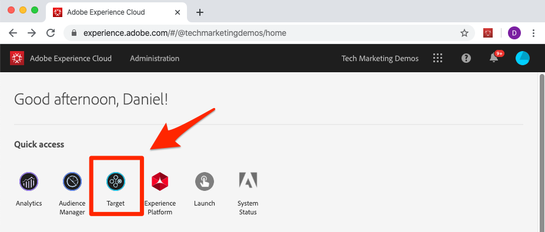
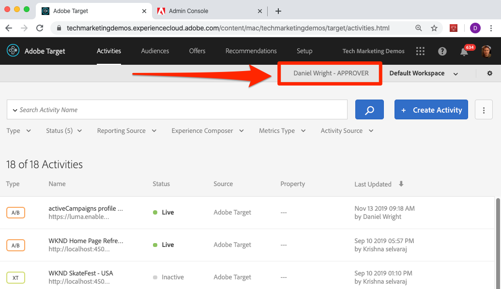

# Adobe Target con Adobe Mobile Services SDK v4 para Android: información general

_Adobe Target con Adobe Mobile Services SDK v4 para Android_ es el punto de partida perfecto para los desarrolladores de Android que ya usan Adobe Mobile Services SDK v4 y desean comenzar a personalizar las experiencias de la aplicación con Adobe Target.

Se proporciona una aplicación de Android de ejemplo para completar las lecciones. Después de completar este tutorial, debe estar preparado para empezar a implementar [!DNL Target] en su propia aplicación de Android.

Tras completar este tutorial, podrá:

* Validar la configuración de [Adobe Mobile Services SDK](https://experienceleague.adobe.com/docs/mobile-services/android/getting-started-android/requirements.html?lang=es)
* Implementar los siguientes tipos de [!DNL Target] solicitudes:
   * Recuperación previa del contenido [!DNL Target]
   * Lote de varias ubicaciones de [!DNL Target] (mboxes) en una sola solicitud
   * Bloqueo de solicitudes (se ejecuta antes de que se muestre la aplicación)
   * Solicitudes sin bloqueo (se ejecuta en segundo plano)
   * Tiempo real (sin almacenamiento en caché)
   * Recuperación de eliminación de caché
* Añadir parámetros a las solicitudes de personalización mejorada
* Creación de audiencias y ofertas
* Personalizar diseños
* Despliegue de nuevas funciones con indicador de funciones

## Requisitos previos  

En estas lecciones, se da por hecho que:

* Tener un Adobe ID y acceso a nivel de aprobador a la interfaz de Adobe Target (consulte los pasos de verificación a continuación)
* Conocer el código de cliente de Adobe Target para poder realizar solicitudes a su propia cuenta. El código de cliente se muestra en la interfaz de Adobe Target en la   Pantalla Configuración > Implementación > Editar la configuración de at.js
* Tener acceso a y estar familiarizado con la [interfaz de usuario de Mobile Services](https://mobilemarketing.adobe.com/)
* Tener un IDE para el desarrollo de aplicaciones móviles de Android. Este tutorial incluye [Android Studio](https://developer.android.com/studio/install) en varios pasos y capturas de pantalla

Si no tiene el acceso necesario a las soluciones de Experience Cloud, póngase en contacto con su administrador de Experience Cloud.

Además, se da por hecho que está familiarizado con el desarrollo de Android en Java. No necesita ser experto en Java para completar las lecciones, pero obtendrá más información si puede leer y comprender el código con comodidad.

### Verificar el acceso a Adobe Target

Esta lección requiere acceso a Adobe Target. Antes de pasar a los siguientes pasos, asegúrese de que tiene acceso a Adobe Target haciendo lo siguiente:

1. Iniciar sesión en [Adobe Experience Cloud](https://experience.adobe.com/)
1. En la pantalla de inicio de Experience Cloud, haga clic en [!DNL Target]:
   
1. Debe llegar a la lista Actividades en Adobe Target, como se muestra a continuación, y debe ver que su usuario tiene acceso de nivel de Aprobador. Si no puede acceder a [!DNL Target] o no puede verificar el acceso de nivel de aprobador, póngase en contacto con uno de los administradores de Experience Cloud de su empresa, solicite este acceso y reanude este tutorial una vez que se le haya concedido:

   

## Acerca de las lecciones

En estas lecciones, debe implementar Adobe Target en una aplicación de viajes de demostración llamada &quot;We.Travel&quot; con su propia cuenta de Adobe Target. Al final del tutorial, enviará mensajes personalizados al usuario en función de su uso de la aplicación. Las experiencias de personalización finales lucirán de esta manera:

Después de recorrer la implementación dentro de la aplicación We.Travel, podrá empezar a usar [!DNL Target] en su propia aplicación móvil.

¡Vamos a empezar!

**[SIGUIENTE: &quot;Descargar y actualizar la aplicación de ejemplo&quot; >](download-and-update-the-sample-app.md)**
