# Personalizar diseños

Ahora es el momento de juntar todo y crear las experiencias personalizadas. Una _Actividad_ es el mecanismo de [!DNL Target] que vincula las ubicaciones, audiencias y ofertas juntas, de modo que cuando se realice la solicitud desde la aplicación, [!DNL Target] responda con el contenido personalizado. Generaremos dos actividades de personalización en [!DNL Target] y validaremos que el contenido personalizado se muestra al usuario correcto en el momento y en la ubicación correctos.

## Objetivos de aprendizaje

Al final de esta lección, podrá hacer lo siguiente:

* Crear actividades en Adobe Target
* Valide las actividades en la aplicación de ejemplo.

## Crear actividades en Adobe Target

Obtenga información sobre cómo crear actividades de Participación de usuarios y Ofertas contextuales.

### Primera actividad: &quot;Participación de usuarios&quot;

Este es un resumen de la actividad que vamos a crear:

| Público | Ubicaciones | Ofertas |
|---|---|---|
| Nuevos usuarios de aplicaciones móviles | wetravel_engage_home, wetravel_engage_search | Inicio: Interactuar con nuevos usuarios, Buscar: Interactuar con nuevos usuarios |
| Devolución de usuarios de aplicaciones móviles | wetravel_engage_home, wetravel_engage_search | Inicio: Usuarios que regresan, default_content |

En la interfaz [!DNL Target], haga lo siguiente:

1. Seleccione **[!UICONTROL Actividades]** > **[!UICONTROL Crear actividad]** > **[!UICONTROL Segmentación de experiencias]**.

   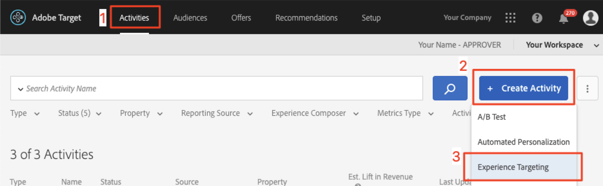

1. Haga clic en **[!UICONTROL Aplicación móvil]**.
1. Seleccione **[!UICONTROL Compositor de formularios]**.
1. Seleccione el espacio de trabajo (el mismo que utilizó en lecciones anteriores).
1. Seleccione su propiedad (la misma propiedad que utilizó en lecciones anteriores).
1. Haga clic en **[!UICONTROL Siguiente]**.

   

1. Cambie el título de la actividad a **[!UICONTROL Participación de usuarios]**.
1. Seleccione los **[!UICONTROL puntos suspensivos]** > **[!UICONTROL Cambiar audiencia]**.
   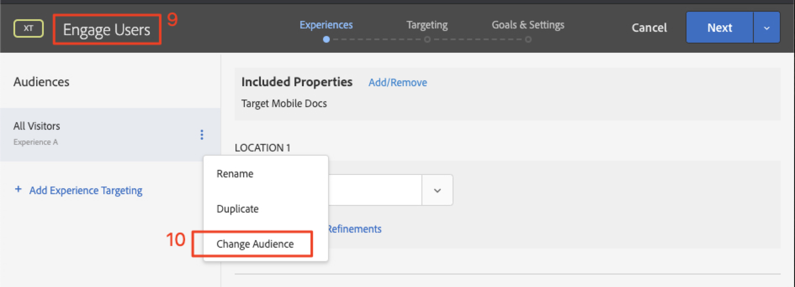
1. Establezca la audiencia en **[!UICONTROL Nuevos usuarios de aplicaciones móviles]**.
1. Haga clic en **[!UICONTROL Finalizado]**.
   

1. Cambiar la ubicación a _wetravel_ engage_home_.
1. Seleccione la flecha desplegable junto a Contenido predeterminado y seleccione **[!UICONTROL Cambiar oferta de HTML]**.

   

1. Seleccione la oferta **[!UICONTROL Inicio: Captar nuevos usuarios]**.
1. Seleccione **[!UICONTROL Listo]**.

   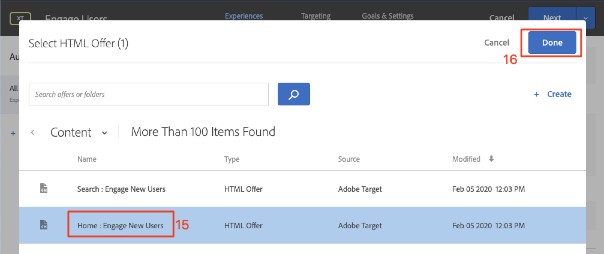

1. Seleccione **[!UICONTROL Agregar ubicación]**.
   

1. Seleccione la ubicación _wetravel_ engage_search_.
1. Cambie la oferta de HTML.

   

1. Seleccione la oferta **[!UICONTROL Buscar: Captar nuevos usuarios]**.
1. Haga clic en **[!UICONTROL Finalizado]**.

   

Acaba de conectar una audiencia a ubicaciones y ofertas para crear la experiencia personalizada para los nuevos usuarios de aplicaciones móviles. La experiencia debería tener un aspecto similar al siguiente:

Ahora cree una experiencia para los usuarios de aplicaciones móviles que regresan:

1. Seleccione **[!UICONTROL Agregar segmentación de experiencias]** a la izquierda.
1. Seleccione la audiencia **[!UICONTROL Usuarios que regresan de aplicaciones móviles]**.
1. Seleccione **[!UICONTROL Listo]**.
   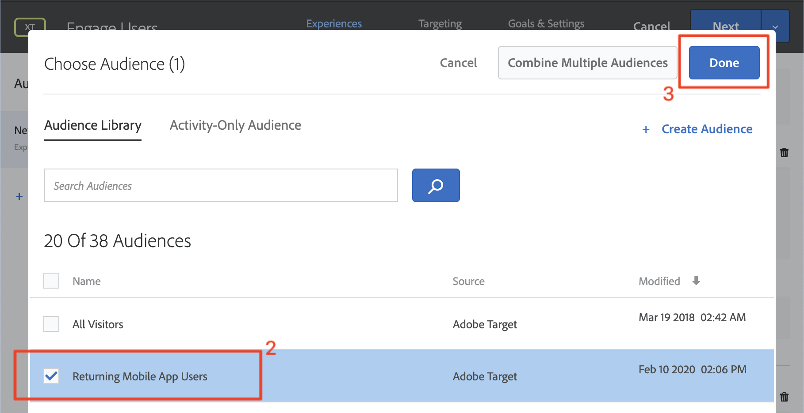

Ahora utilice el mismo proceso que utilizamos anteriormente para configurar la nueva experiencia. La configuración de la experiencia Devolución de usuarios de aplicaciones móviles debería ser similar a la siguiente:

Vamos a pasar a la siguiente pantalla de la configuración:

1. Haga clic en **[!UICONTROL Siguiente]** para avanzar a la pantalla de **[!UICONTROL Segmentación]**.
1. Utilice la configuración predeterminada para Segmentación. Si tiene experiencias para audiencias que se superpusieron (por ejemplo, _Usuarios de Nueva York_ y _Usuarios por primera vez_), puede organizar el orden de prioridad en esta pantalla.
1. Haz clic en **[!UICONTROL Siguiente]** para avanzar a **[!UICONTROL Objetivos y configuración]**.

   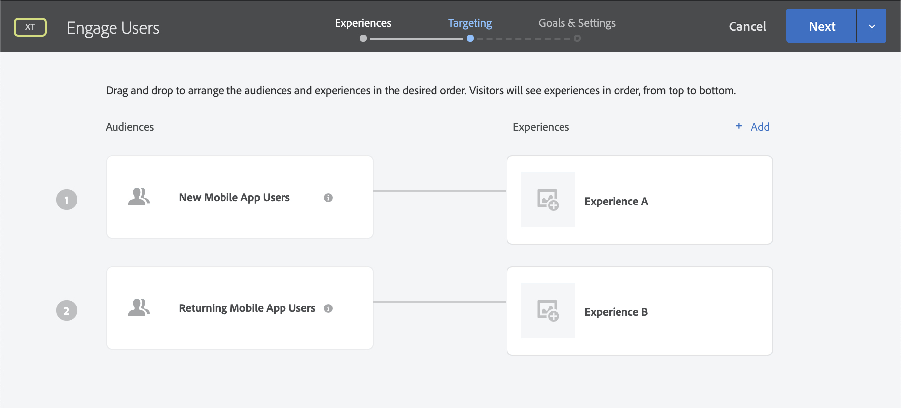

Ahora vamos a completar la configuración de la actividad:

1. Definir **[!UICONTROL objetivo principal]** en **[!UICONTROL Conversión]**.
1. Definir la acción en **[!UICONTROL Visualizó un mbox]** > _wetravel_ context_dest_ (como esta ubicación está en la pantalla de confirmación, podemos usarla para medir las conversiones).

   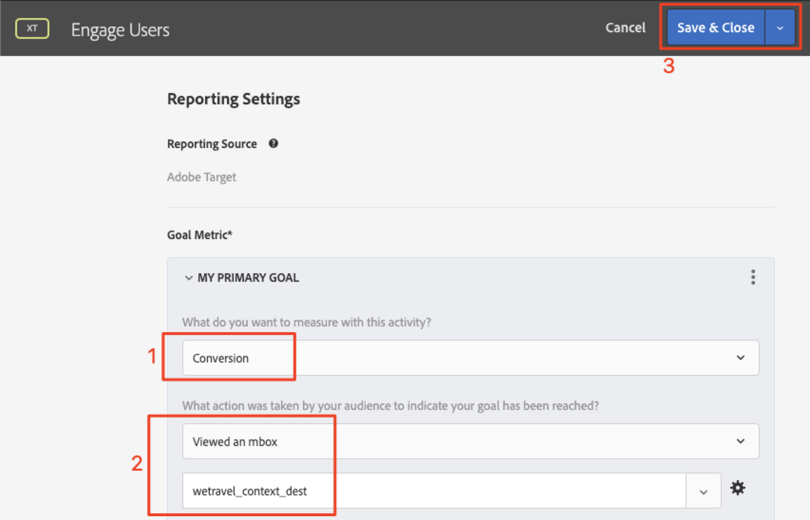

1. Mantenga el resto de configuraciones en la pantalla con los valores predeterminados.
1. Haga clic en **[!UICONTROL Guardar y cerrar]** para guardar la actividad.
1. Activar la **[!UICONTROL Actividad]** en la pantalla siguiente.

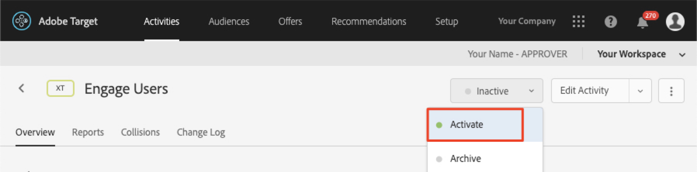

Nuestra primera actividad ya está activa y lista para probar.

### Segunda actividad: &quot;Ofertas contextuales&quot;

Este es un resumen de la segunda actividad que crearemos:

| Público | Ubicación | Ofertas |
| --- | --- | --- |
| Destino: San Diego | wetravel_context_dest | Promoción para San Diego |
| Destino: Los Ángeles | wetravel_context_dest | Promoción para Los Ángeles |

Repita el mismo proceso que se ha descrito anteriormente para la siguiente actividad: &quot;Ofertas contextuales&quot;. A continuación, se muestra la configuración final para ambas experiencias:

#### San Diego

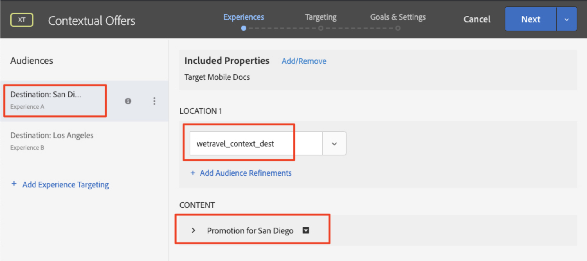

#### Los Ángeles

En el paso Objetivos y configuración, cambiaremos la meta principal a la ubicación en la pantalla de confirmación de la reserva:

1. En **[!UICONTROL Configuración de informes]**, establezca el **[!UICONTROL Objetivo principal]** en **[!UICONTROL Conversión]**.
1. Establezca la acción en **[!UICONTROL Visualizó un mbox]** > _wetravel_ context_dest_ (en esta actividad, esta métrica básicamente no tiene sentido, ya que también es la misma ubicación que ofrece la experiencia).
1. Haga clic en **[!UICONTROL Guardar y cerrar]**.

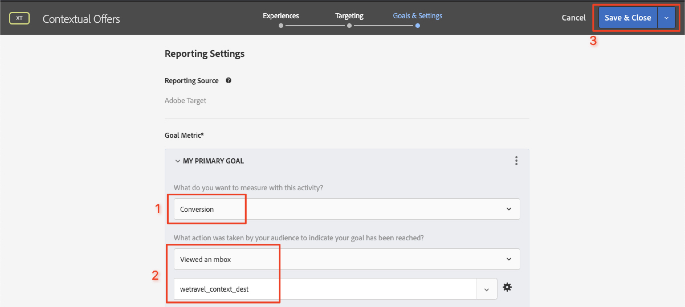

Active la actividad en la pantalla siguiente.

Ahora, la segunda actividad está activa y lista para probarse.

## Validar la oferta de inicio

Ejecute el emulador y observe si se muestra la primera oferta en la parte inferior de la pantalla principal. Si eres un usuario que regresa con 5 o más inicios de aplicación, verás la oferta _bienvenido de nuevo_. Si es un usuario nuevo (menos de 5 inicios de aplicación), debería ver el mensaje _nuevo usuario_:

Si no se muestra la nueva oferta de usuario, intente borrar los datos del emulador. Esto restablecerá los inicios de la aplicación a 1 la próxima vez que la inicie. Esto se hace en **[!UICONTROL Herramientas]** > **[!UICONTROL Administrador AVD]**. Es posible que también tenga que reiniciar Android Studio si Logcat no funciona correctamente:

También puede validar la respuesta en Logcat filtrando por _wetravel_ engage_home_:

## Validación de la oferta de búsqueda

Seleccione **[!UICONTROL San José]** como su **[!UICONTROL Salida]** y **[!UICONTROL San Diego]** como su **[!UICONTROL Destino]** y haga clic en **[!UICONTROL Buscar autobús]** para buscar los autobuses disponibles.

En la pantalla de resultados, debería ver el mensaje _usar filtros_. Si es un usuario que regresa con 5 o más inicios de aplicación, no aparecerá ningún mensaje aquí, ya que el contenido predeterminado está configurado para esta ubicación (que está en blanco):

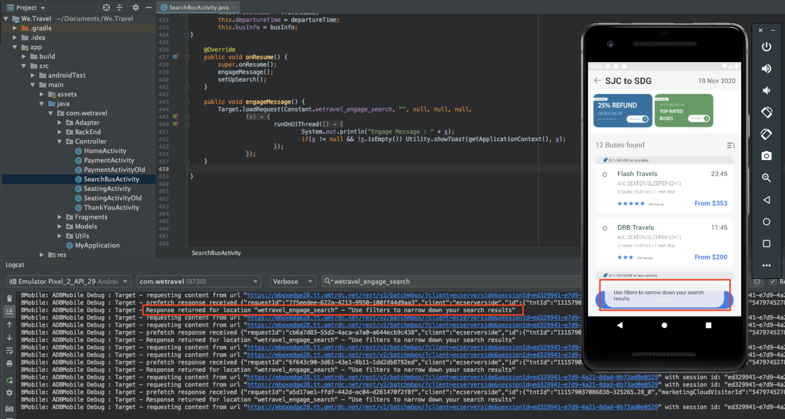

## Validación de las ofertas contextuales en la pantalla de agradecimiento

Ahora continúe con el proceso de reserva:

* Seleccione un bus en la pantalla de resultados.
* Seleccione un asiento en la pantalla de pago y envío.
* Selecciona **[!UICONTROL Tarjeta de crédito]** en la pantalla de pago (deja la información de pago en blanco - no se realizará ninguna reserva real).

Como San Diego fue seleccionado como destino, debería ver el banner de la oferta _DJ SAM_ en la pantalla de confirmación:

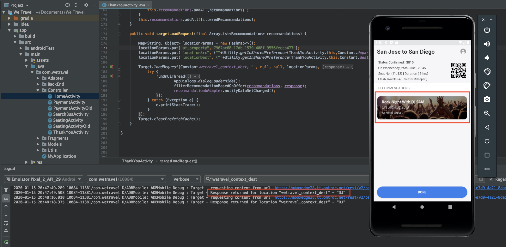

Ahora selecciona **[!UICONTROL Listo]** y prueba otra reserva con Los Ángeles como destino. La pantalla de confirmación debería mostrar el banner de _Universal Studios_:

## Conclusión

¡Felicidades! Con esto concluye la parte principal del tutorial de Adobe Target SDK 4.x para Android. Ahora tiene las habilidades para implementar la personalización en aplicaciones de Android. Puede consultar esta documentación y la aplicación de demostración como referencia para sus futuros proyectos.

Siguiente: El indicador de funciones es otra función que se puede implementar con Adobe Target en Android. Para obtener más información sobre el marcado de características, consulte la siguiente lección.

**[SIGUIENTE: Marca de característica >](feature-flagging.md)**
