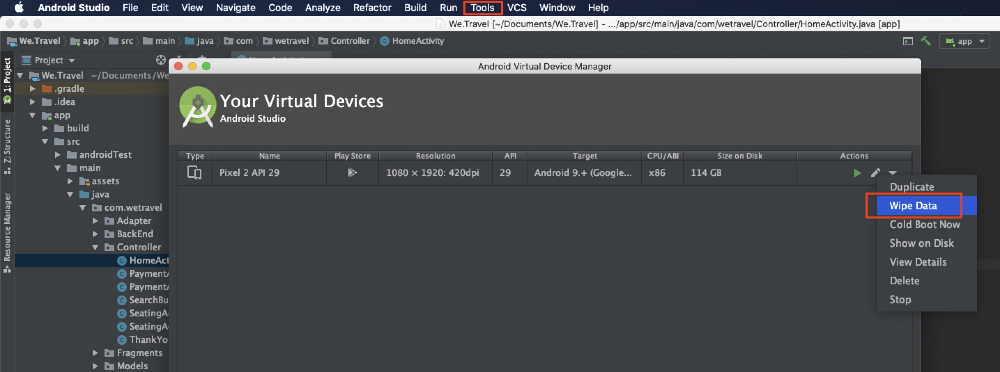

# Personalización de diseños

Ahora es el momento de reunir todo y crear las experiencias personalizadas. Una _actividad_ es el mecanismo [!DNL Target] que vincula las ubicaciones, audiencias y ofertas, de modo que cuando la solicitud se realiza desde la aplicación, [!DNL Target] responde con el contenido personalizado. Generaremos dos actividades de personalización en [!DNL Target] y validaremos que el contenido personalizado se muestra al usuario correcto en el momento adecuado y en la ubicación correcta.

## Objetivos de aprendizaje

Al final de esta lección, podrá:

* Creación de actividades en Adobe Target
* Validación de las actividades en la aplicación de ejemplo

## Crear actividades en Adobe Target

Aprenda a crear actividades de Participación de usuarios y Ofertas contextuales .

### Primera actividad: &quot;Participación de usuarios&quot;

Aquí tiene un resumen de la actividad que crearemos:

| Audiencia | Ubicaciones | Ofertas |
|---|---|---|
| Nuevos usuarios de aplicaciones móviles | wetravel_engagement_home, wetravel_también_search | Inicio: Participar con nuevos usuarios, buscar: Participación de nuevos usuarios |
| Devolución de usuarios de aplicaciones móviles | wetravel_engagement_home, wetravel_también_search | Inicio: Devuelve usuarios, default_content |

En la interfaz [!DNL Target] haga lo siguiente:

1. Seleccione **[!UICONTROL Actividades]** > **[!UICONTROL Crear actividad]** > **[!UICONTROL Segmentación de experiencias]**.

   

1. Haga clic en **[!UICONTROL Aplicación móvil]**.
1. Seleccione el **[!UICONTROL Compositor de formularios]**.
1. Seleccione el espacio de trabajo (el mismo espacio de trabajo que utilizó en lecciones anteriores).
1. Seleccione la propiedad (la misma propiedad que utilizó en lecciones anteriores).
1. Haga clic en **[!UICONTROL Siguiente]**.

   

1. Cambie el título de la actividad a **[!UICONTROL Participación de usuarios]**.
1. Seleccione **[!UICONTROL elipsis]** > **[!UICONTROL Cambiar audiencia]**.
   
1. Configure la audiencia en **[!UICONTROL Nuevos usuarios de aplicaciones móviles]**.
1. Haga clic en **[!UICONTROL Finalizado]**.
   

1. Cambie la ubicación a _wetravel_engagement_home_.
1. Seleccione la flecha desplegable situada junto a Contenido predeterminado y seleccione **[!UICONTROL Cambiar oferta de HTML]**.

   

1. Seleccione el **[!UICONTROL Inicio: Participación de la oferta Nuevos usuarios]**.
1. Seleccione **[!UICONTROL Listo]**.

   

1. Seleccione **[!UICONTROL Agregar ubicación]**.
   

1. Seleccione la ubicación _wetravel_engagement_search_.
1. Cambie la oferta del HTML.

   

1. Seleccione la **[!UICONTROL Búsqueda: Participación de la oferta Nuevos usuarios]**.
1. Haga clic en **[!UICONTROL Finalizado]**.

   

Acaba de conectar una audiencia a ubicaciones y ofertas, creando la experiencia personalizada para los nuevos usuarios de aplicaciones móviles. La experiencia debería tener este aspecto:

Ahora cree una experiencia para los usuarios de aplicaciones móviles que regresan:

1. Seleccione **[!UICONTROL Agregar segmentación de experiencias]** a la izquierda.
1. Seleccione Audiencia **[!UICONTROL Devolución de usuarios de aplicaciones móviles]**.
1. Seleccione **[!UICONTROL Listo]**.
   

Ahora utilice el mismo proceso que usamos anteriormente para configurar la nueva experiencia. La configuración de la experiencia Devolución de usuarios de aplicaciones móviles debería tener este aspecto:

Continuemos con la siguiente pantalla de la configuración:

1. Haga clic en **[!UICONTROL Siguiente]** para avanzar a la pantalla **[!UICONTROL Segmentación]**.
1. Utilice la configuración predeterminada para Segmentación. Si tuvo experiencias para audiencias que se superpusieron (p. ej. _Usuarios de Nueva York_ y _Usuarios nuevos_) puede organizar el orden de prioridad en esta pantalla.
1. Haga clic en **[!UICONTROL Siguiente]** para avanzar a **[!UICONTROL Objetivos y configuración]**.

   

Ahora completemos la configuración de la actividad:

1. Establezca el **[!UICONTROL Objetivo principal]** en **[!UICONTROL Conversión]**.
1. Establezca la acción en **[!UICONTROL Visualizó un mbox]** > _wetravel_context_dest_ (Dado que esta ubicación está en la pantalla de confirmación, podemos utilizarla para medir las conversiones).

   

1. Mantenga el resto de la configuración en la pantalla a los valores predeterminados.
1. Haga clic en **[!UICONTROL Guardar y cerrar]** para guardar la actividad.
1. Active la **[!UICONTROL Actividad]** en la siguiente pantalla.

Nuestra primera actividad está lista para probarse.

### Segunda actividad: &quot;Ofertas contextuales&quot;

Aquí tiene un resumen de la segunda actividad que crearemos:

| Audiencia | Ubicación | Ofertas |
| --- | --- | --- |
| Destino: San Diego | wetravel_context_dest | Promoción para San Diego |
| Destino: Los Ángeles | wetravel_context_dest | Promoción para Los Ángeles |

Repita el mismo proceso que el anterior para la siguiente actividad: &quot;Ofertas contextuales&quot;. A continuación se muestra la configuración final para ambas experiencias:

#### San Diego

#### Los Ángeles

En el paso Objetivos y configuración , cambiaremos el Objetivo principal a la ubicación en la pantalla de confirmación de la reserva:

1. En **[!UICONTROL Configuración de informes]**, establezca el **[!UICONTROL Objetivo principal]** en **[!UICONTROL Conversión]**.
1. Establezca la acción en **[!UICONTROL Visualizó un mbox]** > _wetravel_context_dest_ (en esta actividad, esta métrica básicamente no tiene sentido, ya que también es la misma ubicación que ofrece la experiencia).
1. Haga clic en **[!UICONTROL Guardar y cerrar]**.

Active la actividad en la siguiente pantalla.

¡Ahora nuestra segunda actividad está lista para probarse!

## Validación de la oferta principal

Ejecute el emulador y observe cómo se muestra la primera oferta en la parte inferior de la pantalla principal. Si es un usuario que regresa con 5 o más inicios de aplicación, vería la oferta _welcome back_ mostrada. Si es un usuario nuevo (menos de 5 inicios de aplicación), debería ver el mensaje _nuevo usuario_:

Si la nueva oferta de usuario no se muestra, intente borrar los datos del emulador. Esto restablecerá los inicios de la aplicación a 1 la próxima vez que se inicie. Esto se hace en **[!UICONTROL Herramientas]** > **[!UICONTROL Administrador de AVD]**. También es posible que tenga que reiniciar Android Studio si Logcat no funciona correctamente:

También puede validar la respuesta en Logcat filtrando para _wetravel_engagement_home_:

## Validación de la oferta de búsqueda

Seleccione **[!UICONTROL San José]** como su **[!UICONTROL Salida]** y **[!UICONTROL San Diego]** como su **[!UICONTROL Destino]** y haga clic en **[!UICONTROL Buscar Bus]** para buscar los autobuses disponibles.

En la pantalla de resultados, debería ver el mensaje _use filters_. Si es un usuario que regresa con 5 o más inicios de aplicación, no aparecerá ningún mensaje aquí, ya que el contenido predeterminado se establece para esta ubicación (que está en blanco):

## Validación de las ofertas contextuales en la pantalla de agradecimiento

A continuación, continúe con el proceso de reserva:

* Seleccione un bus en la pantalla de resultados.
* Seleccione un asiento en la pantalla de cierre de compra.
* Seleccione **[!UICONTROL Credit Card]** en la pantalla de pago (deje la información de pago en blanco - no habrá reserva real).

Como San Diego fue seleccionado como destino, debería ver el banner de oferta _DJ SAM_ en la pantalla de confirmación:

Ahora, seleccione **[!UICONTROL Listo]** e intente otra reserva con Los Ángeles como destino. La pantalla de confirmación debe mostrar el banner _Universal Studios_:

## Conclusión. 

¡Felicidades! Esto concluye la parte principal del tutorial de Adobe Target SDK 4.x para Android. Ahora tiene las habilidades para implementar la personalización en aplicaciones Android. Puede consultar esta documentación y aplicación de demostración como referencia para sus proyectos futuros.

Siguiente: El marcado de funciones es otra función que se puede implementar con Adobe Target en Android. Para obtener más información sobre el marcado de funciones, consulte la siguiente lección.

**[SIGUIENTE : Marcado de características >](feature-flagging.md)**
