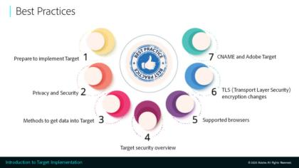

# Aprenda a utilizar Adobe Target

[!DNL Adobe Target] es la variable [!DNL Adobe Experience Cloud] que proporciona todo lo necesario para adaptar y personalizar la experiencia de sus clientes. [!DNL Target] le ayuda a maximizar los ingresos de sus sitios web y móviles, aplicaciones, medios sociales y demás canales digitales. Utilice estos vídeos y tutoriales para conocer los muchos componentes de [!DNL Adobe Target].

>[!NOTE]
>
>Además de esta guía, [!DNL Adobe Target] también hay guías disponibles:
>
>* *[Guía para profesionales de Adobe Target Business](https://experienceleague.adobe.com/docs/target/using/target-home.html?lang=es){target=_blank}*
>
>* *[Guía para desarrolladores de Adobe Target](https://experienceleague.adobe.com/docs/target-dev/developer/overview.html){target=_blank}*

## Novedades

Los siguientes recursos son nuevos:

* **[Configuración de informes de A4T en [!DNL Analysis Workspace] para [!DNL Auto-Allocate] actividades](integrations/set-up-a4t-reports-in-analysis-workspace-for-auto-allocate-activities.md){target=_blank}**

   *Para profesionales del sector empresarial: La variable [!UICONTROL Analytics para Target] Integración de (A4T) para [!UICONTROL Asignación automática] permite ver los datos de los informes en [!DNL Adobe Analytics]e incluso puede optimizar para eventos personalizados o métricas definidos en [!DNL Analytics].*

* **[Configuración de informes de A4T en [!DNL Analysis Workspace] para actividades de [!UICONTROL Segmentación automática]](integrations/set-up-a4t-reports-in-analysis-workspace-for-auto-target-activities.md){target=_blank}**

   *Para profesionales del sector empresarial: ¿Está utilizando A4T para [!UICONTROL Segmentación automática]? Siga estos pasos para configurar los informes de A4T en [!DNL Analysis Workspace] para asegurarse de que se obtienen los resultados esperados al ejecutar [!UICONTROL Segmentación automática] actividades.*

* **[Toma de decisiones en el dispositivo](implementation/on-device-decisioning-overview.md)**

   *Para arquitectos: Introducción a [!UICONTROL toma de decisiones en el dispositivo] para ofrecer experiencias de latencia cercanas a cero a sus consumidores.*

* **[Migrar [!DNL Target] de at.js 2.x a [!DNL Platform Web SDK]](https://experienceleague.adobe.com/docs/platform-learn/migrate-target-to-websdk/introduction.html?lang=es){target=_blank}**

   *Obtenga información sobre cómo migrar una [!DNL Target] Implementación de at.js para [!DNL Adobe Experience Platform Web SDK].*

## Vídeos más populares

<table>
<tr>
  <td>
    
    

      <a href="https://experienceleague.adobe.com/docs/target-dev/developer/server-side/on-device-decisioning/overview.html">
    <strong>Información general sobre la toma de decisiones en el dispositivo</strong>
    </a>
    

    <!--- 

    <em>Learn how to implement the Adobe Target extension with a page load request and custom parameters.</em>
    
 --->
  </td>
   <td>
    
    

    <a href="https://experienceleague.adobe.com/docs/target-learn/tutorials/implementation/2.1-intro-to-target-implementation.html">
    <strong>Introducción a la implementación de Adobe Target</strong>
    </a>
    

    <!--- 

    <em> Learn how to implement at.js 2.0 (and later) in SPAs.</em>
    
 --->
  </td>
  <td>
    
    

      <a href="https://experienceleague.adobe.com/docs/target-learn/tutorials/audiences/create-profile-scripts.html">
    <strong>Creación de scripts de perfil en Adobe Target</strong>
    </a>
    

    <!--- 

    <em>Learn how to use the Adobe Experience Cloud Debugger to understand your [!DNL Target] implementation. Learn how to quickly view your library configuration, examine requests to make sure that your custom parameters are being passed correctly, turn on console logging, and disable all [!DNL Target] requests, and use the Mbox Trace tool.</em>
    
 --->
  </td>
</tr>
</table>

## Selección de personal

<table>
<tr>
  <td>
    
    

      <a href="https://experienceleague.adobe.com/docs/platform-learn/implement-in-websites/implement-solutions/target.html">
    <strong>Implementación de Target con etiquetas de Adobe Experience Platform</strong>
    </a>
    

    

    <em>Obtenga información sobre cómo implementar la extensión de Adobe Target con una solicitud de carga de página y parámetros personalizados.</em>
    

  </td>
   <td>
    
    

    <a href="https://experienceleague.adobe.com/docs/target-learn/tutorials/implementation/implement-atjs-20-in-a-single-page-application.html">
    <strong>Implementar at.js 2.0 en una SPA</strong>
    </a>
    

    

    <em> Aprenda a implementar Adobe Target at.js 2.0 (y versiones posteriores) en Aplicaciones de una sola página (SPA).</em>
    

  </td>
  <td>
    
    

      <a href="https://experienceleague.adobe.com/docs/target-learn/tutorials/troubleshooting/troubleshoot-with-the-experience-cloud-debugger.html">
    <strong>Resolución de problemas de Target con el Experience Cloud Debugger</strong>
    </a>
    

    

    <em>Aprenda a utilizar Adobe Experience Cloud Debugger para comprender su [!DNL Target] implementación.</em>
    

  </td>
</tr>
</table>