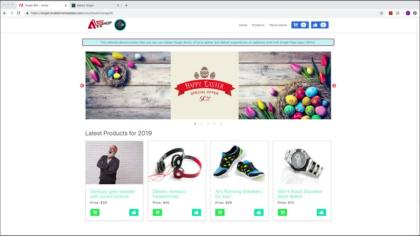

# Tutoriales de Adobe Target

[!DNL Adobe Target] es la solución [!DNL Adobe Experience Cloud] que proporciona todo lo necesario para adaptar y personalizar la experiencia de sus clientes. [!DNL Target] le ayuda a maximizar los ingresos de sus sitios web y móviles, aplicaciones, medios sociales y otros canales digitales. Utilice estos vídeos y tutoriales para conocer todos los componentes de [!DNL Adobe Target].

>[!NOTE]
>
>Además de esta guía, también están disponibles las guías de [!DNL Adobe Target] siguientes:
>
>* *[Guía para profesionales de Adobe Target](https://experienceleague.adobe.com/docs/target/using/target-home.html?lang=es){target=_blank}*
>
>* *[Guía para desarrolladores de Adobe Target](https://experienceleague.adobe.com/docs/target-dev/developer/overview.html?lang=es){target=_blank}*

## Selección de personal

<table style="margin-top: 0 !important">
<tr>
  <td>
    
    

      <a href="https://experienceleague.adobe.com/docs/platform-learn/migrate-target-to-websdk/introduction.html?lang=es">
    <strong>Migrar Target de at.js a Platform Web SDK</strong>
    </a>
    

    

    <em>Obtenga información sobre cómo migrar su implementación de at.js a Adobe Experience Platform Web SDK.</em>
    

  </td>
  <td>
    
    

      <a href="https://experienceleague.adobe.com/docs/platform-learn/implement-in-websites/implement-solutions/target.html">
    <strong>Implementar Target con etiquetas de Adobe Experience Platform</strong>
    </a>
    

    

    <em>Obtenga información sobre cómo implementar la extensión de Adobe Target con una solicitud de carga de página y parámetros personalizados.</em>
    

  </td>
   <td>
    
    

    <a href="https://experienceleague.adobe.com/docs/target-learn/tutorials/implementation/implement-atjs-20-in-a-single-page-application.html">
    <strong>Implementar at.js 2.0 en una SPA</strong>
    </a>
    

    

    <em> Obtenga información sobre cómo implementar at.js 2.0 de Adobe Target (y versiones posteriores) en aplicaciones de una sola página (SPA).</em>
    

  </td>
</tr>
</table>