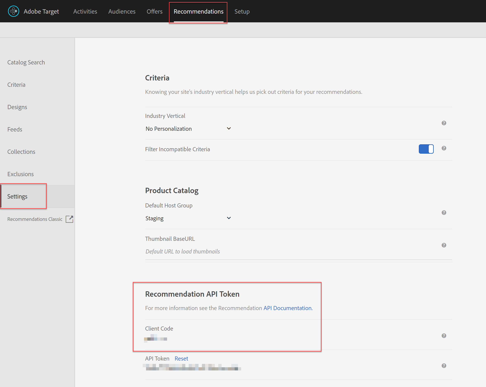

# Recuperación de [!DNL Recommendations] con la API de envío

Las API de Adobe Target y Adobe Target [!DNL Recommendations] se pueden utilizar para enviar respuestas a páginas web, pero también se pueden utilizar en experiencias no basadas en HTML, incluidas aplicaciones, pantallas, consolas, correos electrónicos, kioscos y otros dispositivos de visualización. En otras palabras, cuando [!DNL Target] las bibliotecas y JavaScript no se pueden usar, la **[!DNL Target]API de envío** aún nos permite acceder a toda la gama de funcionalidades [!DNL Target] para ofrecer experiencias personalizadas.

>[!NOTE]
>
> Al solicitar contenido que contenga recomendaciones reales (productos o artículos recomendados), utilice la API de envío [!DNL Target].

Para recuperar las recomendaciones, envíe una llamada de POST de la API de envío de Adobe Target con la información contextual adecuada, que puede incluir un ID de usuario (para su uso con recomendaciones específicas del perfil, como los artículos vistos recientemente por el usuario), el nombre de mbox pertinente, parámetros de mbox, parámetros de perfil u otros atributos. La respuesta incluirá entity.ids recomendado (y puede incluir otros datos de entidad) en formato JSON o HTML, que luego se pueden mostrar en el dispositivo.

La [API de envío](https://developers.adobetarget.com/api/delivery-api/) para Adobe Target expone todas las funciones existentes que proporciona una solicitud [!DNL Target] estándar.

>[!NOTE]
>La API de envío:
>* Permite recuperar experiencias u ofertas para una ubicación y una audiencia de forma RESTful.
>* No requiere autenticación.
>* Solo POST.
>* No procesa cookies ni redirige llamadas.
>* No requiere ni reconoce &quot;funciones de usuario&quot;. Simplemente captura contenido o informes de eventos en [!DNL Target] servidores Edge.

Para utilizar la API de envío para ofrecer [!DNL Target] experiencias, incluidas recomendaciones, siga estos pasos:

1. Cree una actividad [!DNL Target] (A/B, XT, AP o [!DNL Recommendations]) con el Compositor basado en formularios (no el Compositor de experiencias visuales).
2. Utilice la API de envío para obtener una respuesta a las solicitudes generadas por la actividad [!DNL Target] que acaba de crear.

<!-- Q: Why are BOTH steps necessary for this? If you have a Form-based recommendation defined for an mbox, what's the point/benefit of ALSO having the Delivery API step in to retrieve results? Why can't you just have the Form-based Rec deliver the results in the destination device...?? A: See use case below... it's when you want to "intercept" the pending results in order to do more stuff prior to displaying the results. Things like real-time comparisons to inventory levels. -->

## Crear una recomendación con el Compositor de experiencias basadas en formularios

Para crear recomendaciones que se puedan usar con la API de envío, utilice el [Compositor basado en formularios](https://docs.adobe.com/content/help/en/target/using/experiences/form-experience-composer.html).

1. En primer lugar, cree y guarde un diseño basado en JSON para utilizarlo en su recomendación. Para obtener un JSON de muestra, además de información de fondo sobre cómo se pueden devolver las respuestas JSON al configurar una actividad basada en formularios, consulte la documentación sobre [Creación de diseños de recomendación](https://docs.adobe.com/content/help/en/target/using/recommendations/recommendations-design/create-design.html). En este ejemplo, el diseño se llama *JSON simple.*

   

2. En [!DNL Target], vaya a **[!UICONTROL Actividades] > [!UICONTROL Crear actividad] > [!UICONTROL Recommendations]** y, a continuación, seleccione **[!UICONTROL Formulario]**.

   

3. Seleccione una propiedad y haga clic en **[!UICONTROL Siguiente]**.
4. Defina la ubicación en la que desea que los usuarios reciban la respuesta de la recomendación. El ejemplo siguiente utiliza una ubicación denominada *api_charter*. Seleccione su diseño basado en JSON, creado anteriormente, con el nombre *JSON simple.*
   
5. Guarde y active la recomendación. Generará resultados. [Una vez que los resultados estén listos](https://docs.adobe.com/content/help/en/target/using/recommendations/recommendations-activity/previewing-and-launching-your-recommendations-activity.html), puede utilizar la API de envío para recuperarlos.

## Usar la API de envío

La sintaxis de la [API de envío](https://developers.adobetarget.com/api/delivery-api/#tag/Delivery-API) es:

`POST https://{{CLIENT_CODE}}.tt.omtrdc.net/rest/v1/delivery`

1. Tenga en cuenta que se requiere el código de cliente. Como recordatorio, el código de cliente se puede encontrar en Adobe Target navegando a **[!UICONTROL Recommendations] > [!UICONTROL Settings]**. Tenga en cuenta el valor **[!UICONTROL Client Code]** en la sección **[!UICONTROL Token de la API de recomendación]**.
   
1. Una vez que tenga el código de cliente, construya la llamada a la API de envío. El ejemplo siguiente comienza con la **[!UICONTROL Llamada de API de envío de mboxes por lotes web]** proporcionada en la [colección Postman de la API de envío](https://developers.adobetarget.com/api/delivery-api/#section/Getting-Started/Postman-Collection), con las modificaciones pertinentes. Por ejemplo:
   * los objetos **browser** y **address** se eliminaron del **Body**, ya que no son necesarios para casos de uso que no sean HTML
   * *api_* charteris aparece como el nombre de la ubicación en este ejemplo
   * se especifica entity.id , ya que esta recomendación se basa en Similitud de contenido, que requiere que se pase una clave de elemento actual a [!DNL Target].
      
pngRecuerde configurar correctamente los parámetros de consulta. Por ejemplo, asegúrese de especificar 
`{{CLIENT_CODE}}` según sea necesario. <!--Q: In the updated call syntax, entity.id is listed as a profileParameter instead of an mboxParameter as in older versions. --> <!--Q: Old image  Old accompanying text: "Note this recommendation is based on Content Similar products based on the entity.id sent via mboxParameters." -->
      
1. Envíe la solicitud. Esto se ejecuta en la ubicación *api_charter*, que tiene una recomendación activa ejecutándose en ella, definida con su diseño JSON que generará una lista de entidades recomendadas.
1. Reciba una respuesta basada en el diseño JSON.
   
pngLa respuesta incluye el ID de clave, así como los ID de entidad de las entidades recomendadas.

El uso de la API de envío con [!DNL Recommendations] de este modo le permite realizar pasos adicionales antes de mostrar las recomendaciones al visitante en el dispositivo que no es HTML. Por ejemplo, puede tomar la respuesta de la API de envío para realizar una búsqueda adicional en tiempo real de los detalles de atributos de entidad (inventario, precio, clasificación, etc.) desde otro sistema (como un CMS, un PIM o una plataforma de comercio electrónico) antes de mostrar los resultados finales.

Con el método descrito en este tutorial, puede obtener cualquier aplicación para aprovechar la respuesta de [!DNL Target] para proporcionar recomendaciones personalizadas.

## Ejemplos de implementaciones

Los siguientes recursos proporcionan ejemplos de varias implementaciones no centradas en HTML. Tenga en cuenta que cada implementación será única, debido al sistema y a los dispositivos involucrados.

| Recurso | Detalles |
| --- | --- |
| [Consumo de API de RESTful en AEM](https://helpx.adobe.com/experience-manager/using/restful-services.html) | Cómo crear e implementar un paquete OSGi de Adobe Experience Manager que consuma datos de un servicio web RESTful de terceros. |
| [Adobe Target en todas partes: implementación del lado del servidor o en IoT](https://expleague.azureedge.net/labs/L733/index.html) | Adobe Summit 2019 Lab que ofrece experiencia práctica para una aplicación React que aprovecha las API del lado del servidor de Adobe Target. |
| [Adobe Target en una aplicación móvil sin el SDK de Adobe](https://community.tealiumiq.com/t5/Universal-Data-Hub/Adobe-Target-in-a-Mobile-App-Without-the-Adobe-SDK/ta-p/26753) | Esta guía le muestra cómo configurar Adobe Target en su aplicación móvil sin instalar el SDK de Adobe. Esta solución utiliza la vista web del SDK de Tealium y el módulo Comandos remotos para enviar y recibir solicitudes a la API de visitante de Adobe (Experience Cloud) y a la API de Adobe Target. |
| [Cómo funciona Adobe Target en las aplicaciones móviles](https://docs.adobe.com/content/help/en/target/using/implement-target/mobile-apps/mobile-how-target-works-mobile-apps.html) | Cómo funciona [!DNL Target] con el SDK de Mobile |
| [Configuración  [!DNL Target] extension in Experience Platform Launch and Implementing [!DNL Target] de las API](https://aep-sdks.gitbook.io/docs/using-mobile-extensions/adobe-target) | Pasos para configurar la extensión [!DNL Target] en el Experience Platform Launch, añadir la extensión [!DNL Target] a la aplicación e implementar las API [!DNL Target] para solicitar actividades, ofertas de recuperación previa e introducir el modo de vista previa visual. |
| [Cliente de nodo de Adobe Target](https://www.npmjs.com/package/@adobe/target-nodejs-sdk) | SDK v1.0 de Node.js de código abierto [!DNL Target] |
| [Información general del servidor](https://docs.adobe.com/content/help/en/target/using/implement-target/server-side/api-and-sdk-overview.html) | Información sobre las API de envío del servidor de Adobe Target, las API de envío por lotes del servidor, el SDK de Node.js y las API [!DNL Recommendations] de Adobe Target. |
| [Adobe Campaign Content Recommendations en correo electrónico](https://medium.com/adobetech/adobe-campaign-content-recommendations-in-email-b51ced771d7f) | Blog que describe cómo aprovechar las recomendaciones de contenido en correos electrónicos a través de Adobe Target y Adobe I/O Runtime en Adobe Campaign. |

## Administración de la configuración [!DNL Recommendations] con API

La mayoría de las veces, las recomendaciones se configuran en la interfaz de usuario de Adobe Target y luego se utilizan o se accede a ellas a través de las API [!DNL Target] por motivos como los mencionados en las secciones anteriores. Esta coordinación de la interfaz de usuario y la API es común. Sin embargo, a veces los usuarios pueden querer realizar todas las acciones a través de API, tanto de la configuración como del uso de los resultados. Aunque es mucho menos común, los usuarios pueden configurar, ejecutar, *y* aprovechar los resultados de las recomendaciones por completo utilizando las API.

En una [sección anterior](manage-catalog.md) hemos aprendido a administrar las entidades de Adobe Target Recommendations y a entregarlas en el servidor. Del mismo modo, Adobe I/O le permite administrar los criterios, las promociones, las colecciones y las plantillas de diseño sin tener que iniciar sesión en Adobe Target. Puede encontrar una lista completa de todas las API [!DNL Recommendations] aquí](http://developers.adobetarget.com/api/recommendations/), pero aquí tiene un resumen para referencia.[

| Recurso | Detalles |
| --- | --- |
| [Colecciones](http://developers.adobetarget.com/api/recommendations/#tag/Collections) | Enumerar, crear, obtener, editar y eliminar colecciones. |
| [Criterios](http://developers.adobetarget.com/api/recommendations/#tag/Criteria) | Enumerar y obtener criterios. |
| [Diseños](http://developers.adobetarget.com/api/recommendations/#tag/Designs) | Enumerar, crear, obtener, editar, eliminar y validar diseños. |
| [Entidades](http://developers.adobetarget.com/api/recommendations/#tag/Entities) | Guarde, elimine y obtenga entidades. |
| [Promociones](http://developers.adobetarget.com/api/recommendations/#tag/Promotions) | Enumerar, crear, obtener, editar y eliminar promociones. |
| [Criterios de categoría](http://developers.adobetarget.com/api/recommendations/#tag/Category-Criteria) | Enumerar, crear, obtener, editar y eliminar criterios de categoría. |
| [Criterios personalizados](http://developers.adobetarget.com/api/recommendations/#tag/Custom-Criteria) | Enumerar, crear, obtener, editar y eliminar criterios personalizados. |
| [Criterios de artículo](http://developers.adobetarget.com/api/recommendations/#tag/Item-Criteria) | Enumerar, crear, obtener, editar y eliminar criterios de elementos. |
| [Criterios de popularidad](http://developers.adobetarget.com/api/recommendations/#tag/Popularity-Criteria) | Enumerar, crear, obtener, editar y eliminar criterios de popularidad. |
| [Criterios de atributo de perfil](http://developers.adobetarget.com/api/recommendations/#tag/Profile-Attribute-Criteria) | Enumerar, crear, obtener, editar y eliminar criterios de atributos de perfil. |
| [Criterios recientes](http://developers.adobetarget.com/api/recommendations/#tag/Recent-Criteria) | Enumerar, crear, obtener, editar y eliminar criterios recientes. |
| [Criterios de secuencia](http://developers.adobetarget.com/api/recommendations/#tag/Sequence-Criteria) | Enumerar, crear, obtener, editar y eliminar criterios de secuencia. |

## Documentación de referencia

* [Documentación de la API de Adobe Target](https://developers.adobetarget.com/api/#getting-started)
* [API de envío de Adobe Target](https://developers.adobetarget.com/api/delivery-api/)
* [ [!DNL Recommendations] Integración con el correo electrónico](https://docs.adobe.com/content/help/en/target/using/recommendations/recommendations-faq/integrating-recs-email.html)

## Resumen y revisión

¡Felicidades! Al finalizar este tutorial, ha aprendido a:
* [Administrar el catálogo mediante la API de Recommendations](manage-catalog.md)
* [Administrar criterios personalizados mediante la API de Recommendations](manage-custom-criteria.md)
* [Uso de la API de envío con Recommendations](fetch-recs-server-side-delivery-api.md)
