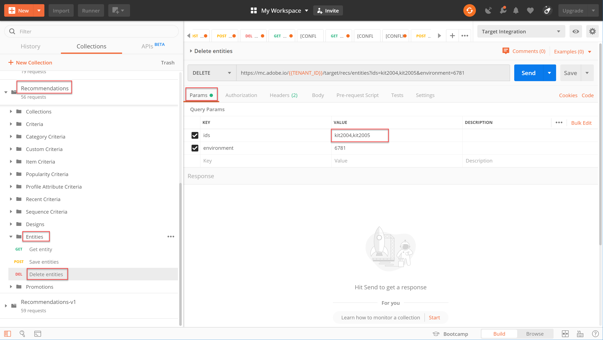

# Administrar el [!DNL Recommendations] catálogo mediante API

En este punto, ha aprendido a generar un token de acceso, utilizando el flujo de autenticación JWT, para utilizar las API de administración de Adobe Target con E/S de Adobe.

Puede utilizar las API de [Recommendations](https://developers.adobetarget.com/api/recommendations/) para agregar, actualizar o eliminar elementos del catálogo de recomendaciones. Al igual que con el resto de las API de administración de Adobe Target, las [!DNL Recommendations] API requieren autenticación.

>[!TIP]
>
>Enviar el **[!UICONTROL IMS: Generar + autenticación JWT mediante solicitud de autentificador]** de usuario siempre que necesite actualizar el token de acceso para la autenticación, ya que caduca pasados 24 horas. Consulte [Configurar la autenticación](../apis/configure-io-target-integration.md) de API de Adobe para obtener instrucciones.


>[!NOTE]
>
>Antes de continuar, obtenga la colección [](https://developers.adobetarget.com/api/recommendations/#section/Postman)Recommendations Postman.

## Creación y actualización de elementos con la API Guardar entidades

Para rellenar la base de datos [!DNL Recommendations] de productos con la API en lugar de una fuente de productos CSV o [!DNL Target] solicitudes que se activan en páginas de productos, utilice la API [](https://developers.adobetarget.com/api/recommendations/#operation/saveEntities)Guardar entidades. Esta solicitud agrega o actualiza un elemento en un solo [!DNL Target] entorno. La sintaxis es:

```
POST https://mc.adobe.io/{{TENANT_ID}}/target/recs/entities
```

Por ejemplo, Guardar entidades puede utilizarse para actualizar artículos cada vez que se alcancen ciertos umbrales (como umbrales de inventario o precio) a fin de marcar esos artículos e impedir que se recomienden.

1. Vaya a **[!DNL Target]>[!UICONTROL Configuración]>[!UICONTROL Hosts]>[!UICONTROL Entornos]** para obtener el ID de [!DNL Target] Entorno en el que desea agregar o actualizar un elemento.

   

2. Compruebe `TENANT_ID` y `API_KEY` haga referencia a las variables de entorno de Postman establecidas anteriormente. Use la siguiente imagen para realizar comparaciones. Si es necesario, modifique los encabezados y la ruta en la solicitud de API para que coincidan con los de la siguiente imagen.

   

3. Introduzca el JSON como código **sin procesar** en el **cuerpo**. No olvide especificar su ID de entorno mediante la `environment` variable. (En el ejemplo siguiente, el ID de entorno es 6781).

   

   >!![NOTE]
   A continuación se muestra un JSON de muestra que agrega entity.id kit2001 con valores de entidad asociados para un producto de hornos de tostadora a entorno 6781.

   ```
      {
      "entities": [{
              "name": "Toaster Oven",
              "id": "kit2001",
              "environment": 6781,
              "categories": [
                  "housewares:appliances"
              ],
              "attributes": {
                  "inventory": 77,
                  "margin": 23,
                  "message": "crashing helicopter",
                  "pageUrl": "www.foobar.foo.com/helicopter.html",
                  "thumbnailUrl": "www.foobar.foo.com/helicopter.jpg",
                  "value": 19.2
              }
          }]
      }
   ```

4. Haga clic en **Enviar**. Debe recibir la siguiente respuesta.

   

El objeto JSON se puede escalar para enviar varios productos. Por ejemplo, este JSON especifica dos entidades.

```
    {
        "entities": [{
                "name": "Toaster Oven",
                "id": "kit2001",
                "environment": 6781,
                "categories": [
                    "housewares:appliances"
                ],
                "attributes": {
                    "inventory": 89,
                    "margin": 11,
                    "message": "Toaster Oven",
                    "pageUrl": "www.foobar.foo.com/helicopter.html",
                    "thumbnailUrl": "www.foobar.foo.com/helicopter.jpg",
                    "value": 102.5
                }
            },
            {
                "name": "Blender",
                "id": "kit2002",
                "environment": 6781,
                "categories": [
                    "housewares:appliances"
                ],
                "attributes": {
                    "inventory": 36,
                    "margin": 5,
                    "message": "Blender",
                    "pageUrl": "www.foobar.foo.com/helicopter.html",
                    "thumbnailUrl": "www.foobar.foo.com/helicopter.jpg",
                    "value": 54.5
                }
            }
        ]
    }
```

1. ¡Ahora es tu turno! Utilice la API de **guardado de entidades** para agregar los siguientes elementos al catálogo. Utilice el JSON de muestra anterior como punto de partida. (Tendrá que ampliar el JSON para incluir entidades adicionales).

   

Vaya, parece que esos dos últimos artículos no pertenecen. Inspeccionémoslos con la API de **obtención de entidad** y, si es necesario, elimínelos con la API de **eliminación de entidades** .

## Obtención de detalles del elemento con la API Get Entity

Para recuperar los detalles de un elemento existente, utilice la API [](https://developers.adobetarget.com/api/recommendations/#operation/getEntity)Get Entity. La sintaxis es:

```
GET https://mc.adobe.io/{{TENANT_ID}}/target/recs/entities/[entity.id]
```

Los detalles de entidad solo se pueden recuperar para una entidad a la vez. Puede utilizar Obtener entidad para confirmar que las actualizaciones se realizaron en el catálogo según lo esperado o para auditar de otro modo el contenido del catálogo.

1. En la solicitud de API, especifique el ID de entidad mediante la variable `entityId`. El siguiente ejemplo devolverá detalles de la entidad cuyo entityId=kit2004.

   

2. Compruebe `TENANT_ID` y `API_KEY` haga referencia a las variables de entorno de Postman establecidas anteriormente. Use la siguiente imagen para realizar comparaciones. Si es necesario, modifique los encabezados y la ruta en la solicitud de API para que coincidan con los de la siguiente imagen.

   

3. Envíe la solicitud.

   Si recibe un error que indica que no se encontró la entidad, como se muestra en el ejemplo anterior, compruebe que está enviando la solicitud al [!DNL Target] entorno correcto.

   >[!NOTE]
   Si no se especifica ningún entorno de forma explícita, Get Entity intenta obtener la entidad únicamente del entorno [](https://docs.adobe.com/content/help/en/target/using/administer/hosts.html#section_4F8539B07C0C45E886E8525C344D5FB0) predeterminado. Si desea extraer de cualquier entorno que no sea el entorno predeterminado, debe especificar el ID de entorno.

4. Si es necesario, agregue el `environmentId` parámetro y vuelva a enviar la solicitud.

   

5. Envíe otra solicitud **Get Entity** , esta vez para inspeccionar la entidad cuya entityId=kit2005.

   

Supongamos que decide que estas entidades deben eliminarse del catálogo. Usemos la API de **eliminación de entidades** .

## Eliminación de elementos con la API de eliminación de entidades

Para eliminar elementos del catálogo, utilice la API [](https://developers.adobetarget.com/api/recommendations/#operation/deleteEntities)Eliminar entidades. La sintaxis es:

```
DELETE https://mc.adobe.io/{{TENANT_ID}}/target/recs/entities?ids=[comma-delimited-entity-ids]&environment=[environmentId]
```

>[!WARNING]
Esta API elimina las entidades a las que hacen referencia los ID que especifique.
Si no se proporciona ningún ID de entidad, se eliminan todas las entidades del entorno dado. Si no se proporciona ningún ID de entorno, las entidades se eliminarán de todos los entornos. ¡Utilícelo con precaución!

1. Vaya a **[!DNL Target]>[!UICONTROL Configuración]>[!UICONTROL Hosts]>[!UICONTROL Entornos]** para obtener el ID de [!DNL Target] Entorno del que desea eliminar elementos.

   

2. En la solicitud de API, especifique los ID de entidad de las entidades que desea eliminar mediante la sintaxis `&ids=[comma-delimited-entity-ids]` (un parámetro de consulta). Al eliminar más de una entidad, separe los ID con comas.

   

3. Especifique el ID de entorno utilizando la sintaxis `&environment=[environmentId]`; de lo contrario, se eliminarán las entidades de todos los entornos.

   

4. Compruebe `TENANT_ID` y `API_KEY` haga referencia a las variables de entorno de Postman establecidas anteriormente. Use la siguiente imagen para realizar comparaciones. Si es necesario, modifique los encabezados y la ruta en la solicitud de API para que coincidan con los de la siguiente imagen.

   

5. Envíe la solicitud.

   

6. Compruebe los resultados con **Get Entity**, que ahora debe indicar que no se pueden encontrar las entidades eliminadas.

   

   

¡Felicidades! Ahora puede utilizar las [!DNL Recommendations] API para crear, actualizar, eliminar y obtener detalles sobre las entidades del catálogo. En la siguiente sección, aprenderá a administrar los criterios personalizados.

[Siguiente &quot;Administrar criterios personalizados&quot; >](manage-custom-criteria.md)
