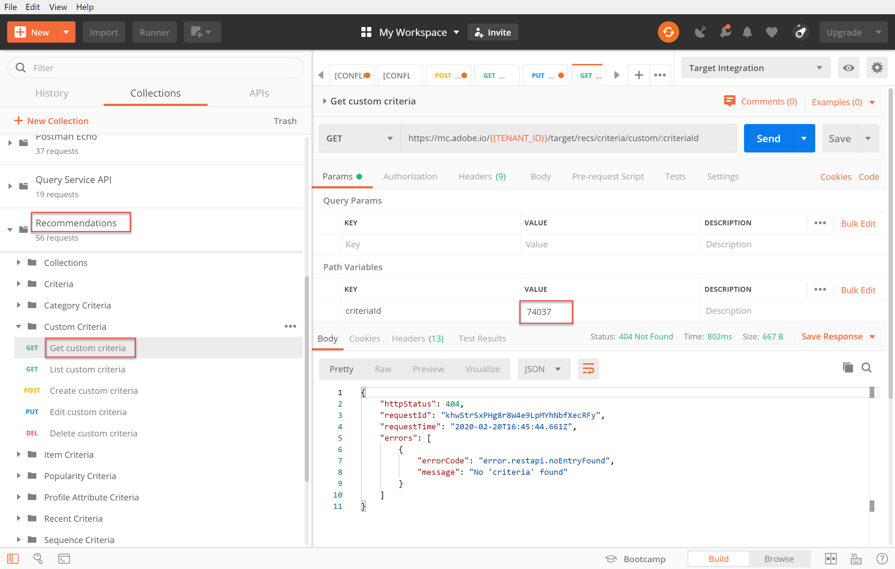

# Administrar criterios personalizados

A veces los algoritmos proporcionados por [!DNL Recommendations] no pueden mostrar elementos concretos que desee promocionar. En tal situación, los criterios personalizados permiten entregar un conjunto específico de artículos recomendados para un elemento clave o categoría determinados. La asignación se define entre el elemento clave o la categoría y los artículos recomendados, y se importa como criterio personalizado. Este proceso se describe en la [documentación de criterios personalizados](https://docs.adobe.com/content/help/en/target/using/recommendations/criteria/recommendations-csv.html). Como se indica en esa documentación, puede crear, editar y eliminar criterios personalizados a través de la interfaz de usuario (IU) [!DNL Target]. Sin embargo, [!DNL Target] también proporciona un conjunto de API de criterios personalizados que permiten una administración más detallada de los criterios personalizados.

>[!IMPORTANT]
>
>Siga esta guía de uso para criterios personalizados:
>
> Haga todo (crear, editar, eliminar) para un criterio personalizado determinado mediante las API o haga todo (crear, editar, eliminar) mediante la interfaz de usuario. La administración de los criterios personalizados mediante una combinación de la interfaz de usuario y la API puede dar lugar a información conflictiva o a resultados inesperados. Por ejemplo, la creación de criterios personalizados en la interfaz de usuario, pero luego su edición mediante API, no reflejarán las actualizaciones en la interfaz de usuario, aunque se actualicen en el servidor, como se puede ver en la API.

## Crear criterios personalizados

Para crear criterios personalizados utilizando la [Create Custom Criteria API](https://developers.adobetarget.com/api/recommendations/#operation/createCriteriaCustom), la sintaxis es:

`POST https://mc.adobe.io/{{TENANT_ID}}/target/recs/criteria/custom`

>[!WARNING]
>
>Los criterios personalizados creados con la API Crear criterios personalizados , tal como se describe en este ejercicio, aparecerán en la interfaz de usuario, donde persistirán. No podrá editarlas ni eliminarlas de la interfaz de usuario. Puede editarlos o eliminarlos **mediante API**, pero de cualquier manera, seguirán apareciendo en la interfaz de usuario [!DNL Target]. Para mantener la opción de editar o eliminar de la interfaz de usuario, cree los criterios personalizados empleando la IU por [documentación](https://docs.adobe.com/content/help/en/target/using/recommendations/criteria/recommendations-csv.html), en lugar de usar la API Crear criterio personalizado.

Continúe solo con este tutorial después de haber leído la advertencia anterior y se sienta cómodo creando nuevos criterios personalizados que no se pueden eliminar posteriormente de la interfaz de usuario.

1. Compruebe `TENANT_ID` y `API_KEY` para **Crear criterios personalizados** y haga referencia a las variables de entorno de Postman establecidas anteriormente. Utilice la siguiente imagen para comparar.

   

2. Añada su **Body** como **raw** JSON que define la ubicación del archivo CSV de criterios personalizados. Utilice el ejemplo proporcionado en la documentación [Crear API de criterios personalizados](https://developers.adobetarget.com/api/recommendations/#operation/getAllCriteriaCustom) como plantilla y proporcione los `environmentId` y otros valores según sea necesario. Para este ejemplo, utilizamos LAST_PURCHASED como clave.

   

3. Envíe la solicitud y observe la respuesta, que contiene los detalles de los criterios personalizados que acaba de crear.

   

4. Para comprobar que se han creado los criterios personalizados, vaya dentro de Adobe Target a **[!UICONTROL Recommendations] > [!UICONTROL Criteria]** y busque los criterios por su nombre, o utilice la **List Custom Criteria API** en el siguiente paso.

   

En este caso, tenemos un error. Investiguemos el error examinando los criterios personalizados más detenidamente, usando la **API de criterios personalizados de lista**.

## Enumerar criterios personalizados

Para recuperar una lista de todos los criterios personalizados junto con los detalles de cada uno, utilice la [List Custom Criteria API](https://developers.adobetarget.com/api/recommendations/#operation/getAllCriteriaCustom). La sintaxis es:

`GET https://mc.adobe.io/{{TENANT_ID}}/target/recs/criteria/custom`

1. Compruebe `TENANT_ID` y `API_KEY` como antes y envíe la solicitud. En la respuesta, tenga en cuenta el ID de criterios personalizados, así como los detalles relativos al mensaje de error que ya se han indicado.
   

En este caso, el error se produjo porque la información del servidor es incorrecta, lo que significa que [!DNL Target] no puede acceder al archivo CSV que contiene la definición de criterios personalizados. Editemos los criterios personalizados para corregirlos.

## Editar criterios personalizados

Para cambiar los detalles de una definición de criterios personalizados, utilice la [Editar API de criterios personalizados](https://developers.adobetarget.com/api/recommendations/#operation/updateCriteriaCustom). La sintaxis es:

`POST https://mc.adobe.io/{{TENANT_ID}}/target/recs/criteria/custom/:criteriaId`

1. Compruebe `TENANT_ID` y `API_KEY`, como antes.
   

1. Especifique el ID de criterio de los criterios personalizados (únicos) que desea editar.
   

1. En el cuerpo, proporcione JSON actualizado con la información correcta del servidor. (Para este paso, especifique el acceso FTP a un servidor al que puede acceder).
   

1. Envíe la solicitud y anote la respuesta.
   

Comprobemos el éxito de los criterios personalizados actualizados mediante la **API Get Custom Criteria**.

## Obtener criterios personalizados

Para ver los detalles de criterios personalizados para un criterio personalizado específico, use [Get Custom Criteria API](https://developers.adobetarget.com/api/recommendations/#operation/getCriteriaCustom). La sintaxis es:

`GET https://mc.adobe.io/{{TENANT_ID}}/target/recs/criteria/custom/:criteriaId`

1. Especifique el ID de criterio de los criterios personalizados cuyos detalles desee obtener. Envíe la solicitud y revise la respuesta.
   
1. Verifique que se ha realizado correctamente. (En nuestro caso, compruebe que no haya más errores de FTP).
   
1. (Opcional) Compruebe que la actualización se refleja con precisión en la interfaz de usuario.
   

## Eliminar criterios personalizados

Con el ID de criterios anotado anteriormente, elimine los criterios personalizados con la [API Eliminar criterios personalizados](https://developers.adobetarget.com/api/recommendations/#operation/deleteCriteriaCustom). La sintaxis es:

`DELETE https://mc.adobe.io/{{TENANT_ID}}/target/recs/criteria/custom/:criteriaId`

1. Especifique el ID de criterio de los criterios personalizados (únicos) que desee eliminar. Haga clic en **Enviar**.
   

1. Compruebe que los criterios se han eliminado mediante Obtener criterios personalizados.
   
En este caso, el error 404 esperado indica que no se pueden encontrar los criterios eliminados.

>[!NOTE]
>Como recordatorio, los criterios no se eliminarán de la interfaz de usuario de [!DNL Target] aunque se hayan eliminado, ya que se crearon con la API Crear criterio personalizado.

¡Felicidades! Ahora puede crear, enumerar, editar, eliminar y obtener detalles sobre criterios personalizados mediante la API [!DNL Recommendations]. En la siguiente sección, utilizará la API de envío [!DNL Target] para recuperar recomendaciones.

[Siguiente: &quot;Buscar Recommendations con la API de envío del lado del servidor&quot; >](fetch-recs-server-side-delivery-api.md)
